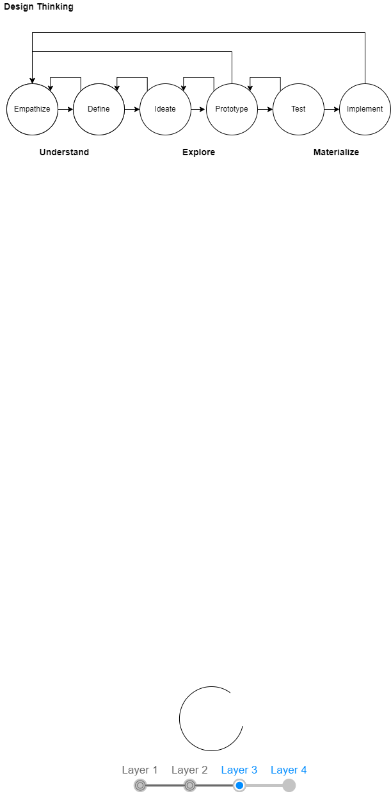

# Application Reference Architecture

## Table of Contents
*Document Generation Date: 2022-04-30 13:04*

* [Application Reference Architecture](#application-reference-architecture)
    * [Table of Contents](#application-reference-architecture-table-of-contents)
* [Introduction](#introduction)
    * [Out-of-Scope](#introduction-out-of-scope)
* [Definitions](#definitions)
    * [Architecture](#definitions-architecture)
    * [Application  Platforms](#definitions-application-platforms)
    * [Application Web Frameworks](#definitions-application-web-frameworks)
    * [Application - Cloud Platforms](#definitions-application-cloud-platforms)
    * [Technology Stacks](#definitions-technology-stacks)
    * [Application Components](#definitions-application-components)
    * [Application Portfolio Management](#definitions-application-portfolio-management)
* [Business](#business)
    * [Business Capability Model (BCM)](#business-business-capability-model-bcm)
    * [Process Maps, Information Flows and Value Streams](#business-process-maps-information-flows-and-value-streams)
    * [Business Governance](#business-business-governance)
    * [Business and Technology Environment](#business-business-and-technology-environment)
    * [Discovery](#business-discovery)
* [Digital Transformation : Design Principles](#digital-transformation-design-principles)
    * [Data is an Asset](#digital-transformation-design-principles-data-is-an-asset)
* [API](#api)
* [Application Characteristics and Styles](#application-characteristics-and-styles)
    * [Application Characteristics](#application-characteristics-and-styles-application-characteristics)
        * [Department Application Characteristics](#application-characteristics-and-styles-application-characteristics-department-application-characteristics)
        * [Quality / Non-Functional Characteristics](#application-characteristics-and-styles-application-characteristics-quality-non-functional-characteristics)
    * [Application Architecture Styles](#application-characteristics-and-styles-application-architecture-styles)
* [Goals for Application Architecture](#goals-for-application-architecture)
    * [Goal:  Technical Debt Reduction](#goals-for-application-architecture-goal-technical-debt-reduction)
    * [Goal:  Composable Enterprise, Composable Applications](#goals-for-application-architecture-goal-composable-enterprise-composable-applications)
        * [Domain Drive Design (DDD) / Bounded Context[^Guidance-11]](#goals-for-application-architecture-goal-composable-enterprise-composable-applications-domain-drive-design-ddd-bounded-context-guidance-11)
        * [GC Directive on Service and Digital - Standards on APIs[^Guidance-13]](#goals-for-application-architecture-goal-composable-enterprise-composable-applications-gc-directive-on-service-and-digital-standards-on-apis-guidance-13)
        * [Decouple User Interfaces](#goals-for-application-architecture-goal-composable-enterprise-composable-applications-decouple-user-interfaces)
        * [SOLID[^Guidance-15] Software Design](#goals-for-application-architecture-goal-composable-enterprise-composable-applications-solid-guidance-15-software-design)
        * [12-Factor Application](#goals-for-application-architecture-goal-composable-enterprise-composable-applications-factor-application)
    * [Develop an API Strategy](#goals-for-application-architecture-develop-an-api-strategy)
        * [Event-Driven Process and Streaming](#goals-for-application-architecture-develop-an-api-strategy-event-driven-process-and-streaming)
    * [Goal: Testability, Testable Applications and Automation](#goals-for-application-architecture-goal-testability-testable-applications-and-automation)
        * [Guidance : Shift-Left Testing](#goals-for-application-architecture-goal-testability-testable-applications-and-automation-guidance-shift-left-testing)
        * [Guidance : Test-Driven Development](#goals-for-application-architecture-goal-testability-testable-applications-and-automation-guidance-test-driven-development)
    * [Goal: Cloud-Native - Future Proof Technology](#goals-for-application-architecture-goal-cloud-native-future-proof-technology)
    * [Goal: User Experience](#goals-for-application-architecture-goal-user-experience)
    * [Goal: Accessibility](#goals-for-application-architecture-goal-accessibility)
* [Creating an Architecture Strategy : Guidance](#creating-an-architecture-strategy-guidance)
    * [Apply Patterns to Formulate a Strategy](#creating-an-architecture-strategy-guidance-apply-patterns-to-formulate-a-strategy)
    * [Design Thinking](#creating-an-architecture-strategy-guidance-design-thinking)
        * [Design thinking principles:](#creating-an-architecture-strategy-guidance-design-thinking-design-thinking-principles)
    * [Patterns](#creating-an-architecture-strategy-guidance-patterns)
        * [Corporate Level Patterns](#creating-an-architecture-strategy-guidance-patterns-corporate-level-patterns)
        * [Department Level Patterns](#creating-an-architecture-strategy-guidance-patterns-department-level-patterns)
* [Application Architecture Styles](#application-architecture-styles-1)
    * [Big Ball of Mud - Anti-Pattern:](#application-architecture-styles-1-big-ball-of-mud-anti-pattern)
    * [Event Driven Architecture Patterns](#application-architecture-styles-1-event-driven-architecture-patterns)
        * [Request-Response communication has the following characteristics:](#application-architecture-styles-1-event-driven-architecture-patterns-request-response-communication-has-the-following-characteristics)
        * [Event streams are based on these concepts:](#application-architecture-styles-1-event-driven-architecture-patterns-event-streams-are-based-on-these-concepts)
        * [EDA Integration Patterns](#application-architecture-styles-1-event-driven-architecture-patterns-eda-integration-patterns)
* [Patterns](#patterns-1)
    * [Software Design Patterns](#patterns-1-software-design-patterns)
    * [User Interface Patterns](#patterns-1-user-interface-patterns)
    * [Business Patterns](#patterns-1-business-patterns)
    * [Cloud Design Patterns](#patterns-1-cloud-design-patterns)
    * [Microservices Patterns](#patterns-1-microservices-patterns)
* [References](#references)
    * [Software](#references-software)
    * [Architecture](#references-architecture-1)
    * [Cloud](#references-cloud)
    * [Design](#references-design)
    * [Patterns](#references-patterns-2)
    * [Principles](#references-principles)
    * [Technologies](#references-technologies)
    * [Government of Canada](#references-government-of-canada)
        * [Digital Standards](#references-government-of-canada-digital-standards)
        * [Digital : Strategic Plan](#references-government-of-canada-digital-strategic-plan)
        * [Information Management](#references-government-of-canada-information-management)
        * [Privacy](#references-government-of-canada-privacy)
* [Misc - To File](#misc-to-file)
* [DDD](#ddd)
* [Appendix - Definitions](#appendix-definitions)
    * [Architecture](#appendix-definitions-architecture-2)
        * [Architecture Quotes](#appendix-definitions-architecture-2-architecture-quotes)
        * [Architecture Style (TOGAF)](#appendix-definitions-architecture-2-architecture-style-togaf)
        * [Architecture Characteristics:](#appendix-definitions-architecture-2-architecture-characteristics)
    * [Application](#appendix-definitions-application)
    * [DevOps](#appendix-definitions-devops)
    * [Governance:](#appendix-definitions-governance)
    * [Policy Framework for Government of Canada](#appendix-definitions-policy-framework-for-government-of-canada)
    * [Principles](#appendix-definitions-principles-1)
    * [Technical Debt](#appendix-definitions-technical-debt)

# Introduction
This document outlines the Application Reference Architecture (ARA) as it applies to our department.  

What is architecture in general?  

- *Architecture is the stuff you can’t Google.* - Mark Richards, O'Reilly
- *Architecture is the decisions that you wish you could get right early in a project, product or project lifecycle* - Ralph Johnson & Martin Fowler
- *Architecture is about the important stuff, whatever that is.* - Ralph Johnson & Martin Fowler

The Application Reference Architecture (ARA) borders on what many would consider an enterprise reference architecture.  This document, the ARA,  attempts to provide an overview of the enterprise environment with a focus on application architecture elements.
- Application architecture describes the behaviour of applications used in a business, focused on how they interact with each other and with users. It is focused on the data consumed and produced by applications rather than their internal structure. In application portfolio management, applications are mapped to business functions and processes as well as costs, functional quality and technical quality in order to assess the value provided." - *[Wikipedia - Application Architect](https://en.wikipedia.org/wiki/Applications_architecture#Application_architect).*
- Enterprise architecture documents the whole architecture and all important elements of the respective organization, covering relevant domains such as business, digital, physical, or organizational; and ii) the relations and interactions between elements that belong to those domains, such as processes, functions, applications, events, data, or technologies." - *[Wikipedia - Enterprise Architect](https://en.wikipedia.org/wiki/Enterprise_architecture)*.  

This document documents:
- existing application architecture within our department
- standards for technical leaders (mandatory)
- guidelines for technical leaders (voluntary)

This document is intended for:
- technical design leads
- technical development team

## Out-of-Scope
- This document is not intended to be a strategy development document.   The ARA is not intended to be a vision, plan or actions towards such a vision.
- The ARA is intended to align and support the many strategies, visions and roadmaps that exist within our department and branch.

neither a vision, nor a strategy nor a roadmap document.   
- This document is neither nor a department culture nor an project management and development process document.
  - Strategy: What we will and will not do, and how govern resources.
  - Culture: People, Processes (Organization / Teams), Communication
  - Development Process: Processes, Tools

# Definitions

## Architecture

|Term|Definition|
|--|----|
|Application|An application, application program or application software is a computer program designed to help people perform an activity|
|Application Architecture (GC EARB)|Application Architecture consists of the interaction of applications with each other and with users. It focuses less on internal mechanics and specific programming and more on overall design on how data is consumed and created by the system. It views the interactions between applications, databases, middleware to ensure scalability, reliability, availability and manageability.|
|Architecture Style|The combination of distinctive features related to the specific context within which architecture is performed or expressed; a collection of principles and characteristics that steer or constrain how an architecture is formed. (TOGAF)|
|Architecture Types/Domains|The overall architecture of an enterprise can be described by integrated sub-architecture domains. These are; Business, Application, Information, Technology, Security, Privacy and Data Architecture|
|Architecture Characteristics|Architecture characteristics are the aspects the system must do that is not directly related to the domain functionality. These are often called non-functional requirements but should be considered as Quality Requirements. An architectural characteristics of concern influences some aspect of the design, and is critical/important to the application's success.|

## Application  Platforms
An application platform provides an environment for software to be executed.

|Discipline or Platform|Definition|Example Products|
|--|----|---|
|Low Code Application|A platform which allows for the creation of applications with little to no code.|Mendix, ServiceNow, Outsystems, Salesforce|
|Business Process Management|A platform which support business processes throught workflows, processes, orchestration and monitoring|Pega Platform, Microsoft Dynamics|
|Robotic Process Automation|A tool which can automation repeated manual tasks.|uiPath|

## Application Web Frameworks
An application framework is a software framework used by software developers following a standard structure supported by the framework.  StackOverflow annual survey identifies the top software languages, databases, web frameworks and tools. - [*2021 StackOverflow 2021 Survey*](https://insights.stackoverflow.com/survey/2021#technology).

|Framework|Definition|Examples|
|--|----|--|
|Application Framework|Software framework for enterprise applications|Spring's framework is used to create Java-based enterprise applications.  .Net is Microsoft led framework (free and open-source).|
|Front-End Frameworks|Create and provide the aesthetics, the user experience, and the visual appeal of web applications|React.js, JQuery, Angular, Vue.js|
|Back-End Frameworks|Provides the framework for the aspects the user does not see, typcially on a server. APIs, dbs, search, caching are common functions|Nodejs, Spring, Ruby on Rails|

## Application - Cloud Platforms
For the ARA, in 2022, our applications are primarily non-cloud based.  Teh Government of Canada uses Azure.

## Technology Stacks

|Stack|Expansion|
|--|----|
|LAMP|Linux, Apache, MySQL, PHP|
|MEAN|MongoDB, Express, Angular, Node.js|

## Application Components

There are many groups of terms relating to applications and application development.

|Term|Definition|
|--|----|
|API|An application programming interface (API) is a connection between computers or between computer programs. An API is a software interface, offering a service to other pieces of software.  An API may be a web-service call (REST API, ...) or a software library or framework (function calls, methods, libraries, ...).|
|Front-End & Back-End|In simple application terms, the front-end of an application is concerned with the presentation to the end-user. In simple application terms, the back-end interacts with the data access layer.|
|Web Service|An API to invoke a service over a network.  Many different standards exist for web service APIs (Service Oriented Architecture - SOA and SOAP, REST API, CORBA). gRPC is newer option (2015) using HTTP and ProtoBuf; while more complex than REST APIs, offers programatic interface description language.   gRPC is often used in micro-service architectures.|

## Application Portfolio Management
Application Portfolio Management (APM) is used by enterprises to manage the lifecyle of applications.  The key goals of APM are to provide oversight to manager risks, reduce costs and make strategic investment decisions.   Some common terms are:

|Term|Definition|
|--|----|
|Application Life Cycle|The stages of an application.  Four stages are commonly used; 1) governance (decision-making stakeholders decided to create an application; 2) development (the process of creating an application), 3) testing and 4) operations and maintenance.  
|Technical Debt|Technical debt is the coding you must do tomorrow because you took a shortcut in order to deliver the software today.|
|IT Governance| IT governance is processes that enable the IT staff to better manage risk and operate efficiently to the benefit of the organization on the whole.|
|Critical Service|A critical service is one that, if disrupted, would result in a high or very high degree of injury to the health, safety, security or economic well-being of Canadians, or to the effective functioning of the Government of Canada.|

# Business

The applications we develop support business models.  When an application is part of a business transformation or digital transformation initiative it is important to have a clear understanding of the businesses strategic direction.   Some common artifacts to communicate this are[^Business-1]:

1. Business Glossary
1. Organizational Map
1. Business Capability Model (BCM) : identify and score capabilities against good system design quality attributes {performance, scalability, stability, monitorability, extensibility, security}
1. Process Maps and Re-engineer Processes : Consider [value streams](https://en.wikipedia.org/wiki/Value_stream).  Model process using BPMN.
1. Define the Metrics : Identify what metrics can help assessment and reflection on desired business outcomes. These metrics must be possible to measure and communicate.
1. Understand the Governance Model: Governance is a meta-process. In your value stream, ask how decisions are made, who the authorities are, what roles they have, and what relevant review boards are.   Operational scorecards.
1. Business Architecture in Applications : What business strategy does this application map to?  Why does this project/application matter?  What new capabilities are you creating?  What major uses cases are performed?  Who are the audiences?

## Business Capability Model (BCM)

A common way for the business to communicate what the organization needs and does is through a business capability model (BCM)[^Business-2]. There are many uses for a BCM.   Product owners can use a BCM to drive convergence in technology and business processes to enterprise standards.   Regular review of aligning the BCM with the department strategy and vision can allow enterprise architects and business architects to identify and prioritize the corresponding IT initiatives with business needs.  Internal committees, working groups and forums can collaborate to identify reusable business process and push for adoption across the organization.  Business capabilities, processes, information flows and value streams should be assessed routinely based on efficiency, priority, and complexity.

Our department has a draft Business Capabiltiy Map (BCM) describing the main capabilities required to fulfill our mandate.   To help support the business our technology teams provide a broad range of IT capabilities.   Our IT department supports many networks both nationally and internationally.  Within the IT department, our software development team supports an extensive catalog of applications.

## Process Maps, Information Flows and Value Streams
Information Flows [^Business-4] is a business view of how information flows between business responsibility centres. *The main purpose of an information flow diagram is so that sources that send and receive information can be displayed neatly and analysed.*.  

Introduced in Lean (1950's) a value stream is a set of actions (workflow) to produce value [^Business-3].  Value Stream Mapping is visual tool introduced in Lean Management methodology to display the value stream with define icons to show delays and inventory stages.   An example value stream might be recruitment "street to seat", "hire to retire" and "procure to pay".

A Process Map[^Business-5] defines the standard business process, and who is responsible for the activity.  

## Business Governance

The health of our portfolio needs to improve as identified in our Corporate Risk Profile (CRP).   Several leadership principles have been established over the years to provide guidance when addressing business needs.   Key principles relating to governing and directing architecture and application design are:

1. __Rationalization__:  With a large backlog of valuable business requests and opportunities application functionality must be constantly rationalized.   During the software development phase, requirements must be rationalized against the original approved project scope and other compete business needs.  The costs of increment application development, both in project costs and ongoing costs must be carefully understood.  This is the process of rationalizing business needs and can include the senior management team when necessary.  [*See Guidance - Rationalization for more information*]

1. __Executive Lead / Change Management__:  Projects and programs need executive sponsors who are committed to the change management and rationalization required to allow IT to develop a product.

1. __Business Architecture and Artifacts__:  The business plays a key role in shaping the application.  Business architecture (capabilities, value streams, information flows, organization model) are essential for successful analysis of the business needs during application development. Significant architecture re-work and design waste result if these are unavailable.  As our department adapts agile methodologies, incremental value in the project can be obtained by the agile team including maturing business artefacts as part of the product backlog.

## Business and Technology Environment
Our Information Technology (IT) operates in a complex and constrained environment due to the sensitivity of information managed.  Awareness of the legislative and departmental directives and policies is crucial at the outset of application development.   A common phrase used in DevOps is to *shift-left* quality attributes like security and privacy.   Key non-functionality quality requirements derived from our environment should be considered at the outset (e.g., official languages act, accessibilty act, information management).   The non-functional requirements should be realistic and follow the SMART guidelines (Specific, Measurable, Achievable, Realistic, Time-Bount)[^Business-6].

[^Business-1]: Hewitt, Eben. Semantic Software Design: A New Theory and Practical Guide for Modern Architects, 2020.  - *[ISBN 978-1-4920-4594-6](http://www.worldcat.org/978-1-4920-4594-6)*

[^Business-2]: [Wikipedia - Business Capability Model](https://en.wikipedia.org/wiki/Business_capability_model)

[^Business-3]: [Wikipedia - Value Streams](https://en.wikipedia.org/wiki/Value_stream)

[^Business-4]: [Wikipedia - Information Flow Diagram](https://en.wikipedia.org/wiki/Information_flow_diagram)

[^Business-5]: [Wikipeida - Business Process Maps](https://en.wikipedia.org/wiki/Business_process_mapping)

[^Business-6]: [Wikipedia (SMART) Requirements](https://en.wikipedia.org/wiki/SMART_criteria)

## Discovery

There are many initiatives within our department that require enterprise and domain architecture effort to recommend the path forward.

1. Identity and Access Management (IdAM):  
Analyze existing identity and access management options to provide multi-domain identity and access to highly  compartmentalized information.

1. Enterprise Integration & Interoperability:  
Analyze steps to mature our ability create a composable enterprise recommended by Gartner.[^Discovery-1].  This guide recommends creating Reference Architectures which is modular.  The modules can be composed and indepently improved.  "*The framework is based on the ability to assemble and reassemble various digital assets and business elements for real-time adaptability and resilience in the face of uncertainty.*".  The guide identifies the need for business strategy documents, roadmaps and business architecture deliverables to inform reference architecture creation.

1. Enterprise Search:  
Gartner calls the broader enterprise search an Insight Engine. [Gartner - Critical Capabilities for an Insight Engine](https://www.gartner.com/document/4000026?ref=solrAll&refval=312773615).  [[Gartner Magic Quadrant - Insight Engines]](https://www.gartner.com/document/3999454?ref=ddisp&refval=4000026).  Key terms include; connectors, touch points, integrations.  Popular open-source solutions like Solr and Elastic support API integrations for adding and removing content with structured-metadata.   A key to the success of enterprise search is the ability to structure the index information with metadata.  This enables discover and faceted searches.
  - [ ] Enterprise Taxonomy : A deliverable within the Information Management Modernization program (IMmod)

1. Multi-Security Zone Applications:  
Our directorate has been asked to to move workloads to lower security zones.  As a consequence business processes may span security zones.  The cross-domain-solution has been identified as an enabler technology.  What overall application, data, information and security architecture is needed to realize these benefits.    

1. Managing Media
Our department manages multimedia (images, audio and video files) as well as file-types on a diverse range of applications.  Media management can be addressed be a Media Management Platform and a Digital Experience Platform (DXP).  Industry leaders include OpenText, Oracle and Salesforce.  While some Content Management Systems (CMS) also support DXP features many new market entrants are SaaS-based and require cloud connectivity (e.g, Sanity.io).   OpenText DXP() is not in the top-magic quadrant; however it deserves consideration due to GCdocs.
- [OpenText DXP](https://www.opentext.com/products-and-solutions/products/customer-experience-management/digital-experience-platform)
- [Opentext Why you Need a DXP](https://blogs.opentext.com/digital-experience-platform/): *Orchestrating a cohesive, contextual experience that meets brand standards, achieves business goals across all channels and touchpoints, while it delights the recipient, is a massively difficult task.*

Features of a DXP:
- Content Management System
- Media Asset Management
- Digital Asset Management (media and non-media content)
- Headless DXP / CMS : Provide back-end features expose media assets via API's.

TODO - reference Confluence ITOD Dependencies document
TODO - Add Enterprise Interoperability to ITOD Dependencies

[^Discovery-1]: [Gartner- Ignition Guide to Building Reference Architectures for a Composable Business](https://www.gartner.com/document/4008989?ref=solrAll&refval=323632540)

# Digital Transformation : Design Principles

There are many sources for digital principles.  The Government of Canada has identified the following standards.  The standards are in support of the Digital Operations Strategic Plan[^Principles-DOSP] :

| Principle  |Description                                                                                                                                                                                      | Supported By                                                                                                                  |
| :-- | :---- | :-- |
| Use Open Standards and Solutions by Default          | Open Source, Prioritize (open source, COTS, custom), contribute to open-source                                                                                                                   | GC[^Principles-2], Digital Principles[^Principles-1]                                                                          |
| Maximize Reuse, Reuse and Improve                    | Leverage existing solutions, minimize duplication.                                                                                                                                               | GC[^Principles-2], Digital Principles[^Principles-1]                                                                          |
| Design for Users First                               | User-centred methods, focus on users, using agile.                                                                                                                                               | GC[^Principles-2], Digital Principles[^Principles-1]                                                                          |
| Deliver with Multidisciplinary Teams                 | Include all skillsets required for delivery                                                                                                                                                      | GC[^Principles-2], Digital Principles[^Principles-1]                                                                          |
| Design for Performance, Availability and Scalability | Design quality into the system.  Use distributed systems (assume failure will happen)                                                                                                            | GC[^Principles-2], Digital Principles[^Principles-1]                                                                          |
| Enable Interoperability                              | Expose functionality as a service.  Use microservices built around business capabilities.  Scope each service to a single purpose.  Use APIs.  Use the Canadian Digital Exchange Platform (CDXP) | GC[^Principles-2], GC API Standards[^Principles-API], GC Service & Digital[^Principles-DSP],Digital Principles[^Principles-1] |
| Design Systems to be Measurable and Accountable      | Publish Service Level Agreements (SLAs), Make an audit trail for all transactions (traceability).                                                                                                | GC[^Principles-2]                                                                                                             |
| Keep Data Organized                                  | Decouple master data from applications.  Make systems or record (SOR) authoritative sources, use Master Data Management (MDM)                                                                    | GC[^Principles-2]                                                                                                             |
| Use Cloud First                                      | Use SaaS -> PaaS -> IaaS                                                                                                                                                                         | GC[^Principles-2], GC Service & Digital[^Principles-DSP]                                                                      |
Design for Security and Privacy|	Categorize data, perform a privacy impact assessment on personally identifiable information (PII)|GC[^Principles-2], Digital Principles[^Principles-1]|

The website *Principles for Digital Design*[^Principles-1] [*Design Principles*](https://digitalprinciples.org/principles/) reference in *Hewitt, Eben. Semantic Software Design: A New Theory and Practical Guide for Modern Architects, 2020.*.

- Design with the User : User-centered design starts with getting to know the people you are designing for through conversation, observation and co-creation.

- Understand the Existing Ecosystem : Well-designed initiatives and digital tools consider the particular structures and needs that exist in each country, region and community.

- Design for Scale: Achieving scale requires adoption beyond an initiatives pilot population and often necessitates securing funding or partners that take the initiative to new communities or regions.

- Build for Sustainability : Building sustainable programs, platforms and digital tools is essential to maintain user and stakeholder support, as well as to maximize long-term impact.

- Be Data Driven : When an initiative is data driven, quality information is available to the right people when they need it, and they are using those data to take action.

- Use Open Standards, Open Data, Open Source, and Open Innovation: An open approach to digital development can help to increase collaboration in the digital development community and avoid duplicating work that has already been done.

- Reuse and Improve : Reusing and improving is about taking the work of the global development community further than any organization or program can do alone.

- Address Privacy and Security : Addressing privacy and security in digital development involves careful consideration of which data are collected and how data are acquired, used, stored and shared.

- Be Collaborative : Being collaborative means sharing information, insights, strategies and resources across projects, organizations and sectors, leading to increased efficiency and impact.

## Data is an Asset
What are the application architecture implications of "data is an asset"?
- Past: In the past, applications were made to help users accomplish a task.  The data design model might have been part of the software development process, but it was not a prioritized objective.   
- Today: With data as an asset being a core principle, considerable time should be spent defining how data is collected, stored, organized/modelled, __protected__, and making it available to other applications.

# API
2002 Amazon API Principle [[reference](https://apievangelist.com/2012/01/12/the-secret-to-amazons-success-internal-apis/)]:
- All teams will henceforth expose their data and functionality through service interfaces.
- Teams must communicate with each other through these interfaces.
There will be no other form of inter-process communication allowed: no direct linking, no direct reads of another team’s data store, no shared-memory model, no back-doors whatsoever. The only - communication allowed is via service interface calls over the network.
- It doesn’t matter what technology they use.
All service interfaces, without exception, must be designed from the ground up to be externalizable. That is to say, the team must plan and design to be able to expose the interface to developers in - the outside world. No exceptions.
- __Anyone who doesn’t do this will be fired.__  Thank you; have a nice day!

From "Hewitt, Eben. Semantic Software Design: A New Theory and Practical Guide for Modern Architects, 2020"
- The protocol, too, is another element to consider in our deconstructed method. After doing this for more than 20 years, it becomes very apparent how much time we technologists spend rearranging the furniture for the flavor of the month. Everyone had to switch everything to SOAP. Then they hated SOAP and had to switch everything to XML. Then they hated that and had to switch everything to JSON. The clever minority touted ProtoBuf. Popular products like Cassandra used Avro, so a patch of proponents pop up around that. Soon something else will come along.

- Postman - 12 features to help solve API problems : https://apievangelist.com/2022/01/27/twenty-problems-that-postman-is-solving-for-developers-in-2022/

[^Principles-1]: [*Principles for Digital Design*](https://digitalprinciples.org/principles/]

[^Principles-2]: [CTO - Government of Canada Digital Standards](https://www.canada.ca/en/government/system/digital-government/government-canada-digital-standards.html)

[^Principles-DOSP]: [GC Digital Operations Strategic Plan - 2021-2024](https://www.canada.ca/en/government/system/digital-government/government-canada-digital-operations-strategic-plans/digital-operations-strategic-plan-2021-2024.html)

[^Principles-DSP]: [Directive on Service and Digital](https://www.tbs-sct.canada.ca/pol/doc-eng.aspx?id=32601)

[^Principles-API]: [Standards on APIs](https://www.canada.ca/en/government/system/digital-government/modern-emerging-technologies/government-canada-standards-apis.html)

[^Principles-TOGAF]: [*TOGAF Architecture Principles*](https://pubs.opengroup.org/architecture/togaf8-doc/arch/chap29.html)

[^Principles-XXXX]: [Hewitt, Eben. Semantic Software Design: A New Theory and Practical Guide for Modern Architects, 2020.](www.worldcat.org/isbn/978-1-4920-4594-6)

# Application Characteristics and Styles

TOGAF defines Architecture Style as *the combination of distinctive features related to the specific context within which architecture is performed or expressed; a collection of principles and characteristics that steer or constrain how an architecture is formed.*.   Depend ding on the desired architecture characteristics and different style will be chosen.

  - The GC Digital Operations Strategic Plan[^Application-2] indicates the priorities for services/applications should be *developing and delivering services that, by design, put users first by being accessible, inclusive, secure and easy to use, and that respect privacy and choice of official language*.   This is mostly focused at services the public consumes, versus, services and applications our internal public servants use.

## Application Characteristics
As part of the analysis and design some high-level characteristics of the application should be assessed.   Some of these attributes may be official documented as part of the project and application development, and others may have to be assumed or derived for requirements.

### Department Application Characteristics

|Attribute|Description|Note|
|--|--|--|
|Criticality|How critical is this application to the business. This is sometimes referred to as Tier-1, 2, 3.|The department lacks an official list of application criticality.   Based on criticality, and TBS guidance, critical applications must have certain quality components like a business continuity plan (BCP) and a Disaster Recover Plan (DRP).  This need to maintained and practised like fire alarms on a regular basis.
|Security Profile|Based on the security triad of Confidentiality, Integrity and Availability (CIA) and indicating the impacts of integrity and availability to the organization (High, Medium, Low).|Common profiles are PBMM (Protected-B, Medium, Medium) and TSHH (Top Secret, High, High).  The security profile can help guide development of quality requirements (non-functional requirements)|
|Information Classification|What classification of information is managed by the system|Unclassified, Confidential, Protected A/B/C, Secret and Top Secret are common security classifications|
|IM Repository Type|Identifies whether the information in this system is transitory or corporate.|Based on the repository type additional requirements relating to managing the information through its lifecycle are required. Reference [Guideline on Service and Digital](Requirements for departments under the Directive)|
|Information Business Type|Our department treats operational information different from administrative information.|The distinction is unclear, and there are few guidelines to help projects to help manage this distinction.   Applications are categorized as managing operational or administrative information.  For example, CW is administrative, CWOPS is operational (however only extremely limited operational information is permitted in CWOPS).|

### Quality / Non-Functional Characteristics
Identifying the key quality attributes of the system is required to chose an effective architecture style.  Trade-offs between complexity, scalability, observability, reliability and other attributes is required.  No single architecture style is suitable for all applications.

## Application Architecture Styles
Architectural style is defined as a set of characteristics and features that make a building or other structure notable or historically identifiable. Architecture styles are been established and evolved over the years.   Some common application architecture styles are[^Application-1]:

  - Distributed: Microservices Architecture : pros (reliability, modularity, elasticity, +++), cons: (cost, complexity, ...)

  - Distributed: Orchestration - Service Oriented Architecture (~2005) :
    - pros:  (good elasticity, fault tolerance, scalability), cons: (complexity, testability, cost, ...).  
    - cons: A big weakness of SOA was the use of a common platform for all services deployed (e.g., Oracle SOA Suite, IBM WebSphere, DataPower, MessageBroker).  SOA also required stateful services and sharing of context (tight-coupling).  
    - note, SOA promised loose-coupling, scalability and fault tolerance [Josuttis, N. M. SOA in practice. (O’Reilly, 2007)
](http://www.worldcat.org/978-0-596-52955-0)] however these were difficult to achieve with SOA.

  - Distributed: Event Driven Architecture : pros (fault tolerant, modular, good cost), cons: (complexity, testability, )

  - Monolithic: Layered:  3-tier/N-Tier/Client-Server :  pros (simplicity and cost), cons: (scalability, fault tolerance, deployability, testability, modularity)

  - Monolithic: Pipeline: pipelines & filters : pros (simplicity and cost), cons: (scalability, performance, ...)

[^Application-1]: [Fundamentals of Software Architecture](www.worldcat.org/isbn/978-1-4920-4345-4) : Richards, Mark, and Neal Ford. Fundamentals of Software Architecture: An Engineering Approach. First edition. Beijing Boston Farnham Sebastopol Tokyo: O’Reilly, 2020.

[^Application-2]: [GC Digital Oprations Strategic Plan - 2021-2024](https://www.canada.ca/en/government/system/digital-government/government-canada-digital-operations-strategic-plans/digital-operations-strategic-plan-2021-2024.html)

# Goals for Application Architecture

The following goals are described in this section.  These goals are aimed at becoming more efficient at releasing applicaitons to production, and, in improving the overall developer exerience (DevEx)

The proceeding section will identify guidance to achieve these goals.

1. Technical Debt Reduction
1. Modular Applications and a Composalbe Enterprise
1. APIs
1. Event Driven
1. Build Testable Applications
1. Automation
1. Cloud Native - Future Proof Technology
1. User Experience
1. Accessility

## Goal:  Technical Debt Reduction

Our departments vision includes an *IT Rationalization* pillar which identifies the need to reduce the number of different applications supported by our team.  The Architecture Working Group includes principles which address the need to rationalze the portfolio.  The gaol is to have a smaller and healthier application portfolio through the following guidance:

  - Rationalization
  - Reuse / Buy / Build
  - Document & Exercise Backup & Recovery
  - Develop as per the Criticality of the Application
  - Build Less and Stay Lean

1. Rationalization.

In cooperation with the business, business governance and other stakeholders development of functional and non-functional requirements must be rationalized.  There are many strategies to rationalize development to ensure the project can be completed on time, in an agile manner.  Some strategies for recognized industry leaders include:

  - "Reduce features, focus on the priorities" - [Basecamp - Feature Selection - Start with No](https://basecamp.com/gettingreal/05.3-start-with-no)
  - Apple had suffered from lousy engineering management and Steve Jobs was answering a negative question about a removed feature.  Steve Jobs response was that "*Focusing is about saying no.   When you say no, you piss off people.*"- [Steve Jobs - Focus on Saying No - 1997](https://www.youtube.com/watch?v=H8eP99neOVs):  
  - Are we staying true to the vision? : [Basecamp - Priorities - Whats the Big Idea](https://basecamp.com/gettingreal/04.1-whats-the-big-idea):
  - Prioritize, Focus on what you really want to deliver), Flexibility : Scope flexibility.  It’s better to make half a product than a half-assed product. - [Basecamp - The Starting Line - Fix Time and Budget, Flexibility on Scope](https://basecamp.com/gettingreal/02.4-fix-time-and-budget-flex-scope):
  -  *How does a project get to be a year behind schedule? One day at a time.* - [Fred Brooks 1979 Software Project Management - The Mythical man Month](https://en.wikipedia.org/wiki/The_Mythical_Man-Month). [the mythical man-month - 1975 - isbn](http://www.worldcat.org/isbn/0-201-00650-2)

1. Reuse / Buy / Build.   

  Prior to a business case or project proceeds to development, any new application creation should be discussed with other stakeholders (e.g, TMO - Transformation Management Office, BRMO - Business Relationship Management Office, TRB - Technology Review Board and the AWG - Architecture Review Board).   If a new application is justified, the options analysis should consider the TBS Digital Standards and GC EARB Application Architecture Standards [^Guidance-5].   

  The following priorities for options analysis:

  - Reuse:  Attempt to reuse what we currently own, or what other government departments / partners are using.     
  - Buy: Buy solutions and integrate into our enterprise architecture
  - Build:  As a last resort, custom build a solution.  This should be limited to business capabilities and processes that are unique to our department.  Executive approval (Department Architecture Review Board)  required.

1. Document & Exercise Backup & Recovery

  All applications, regardless or criticality, must have a documented backup and recovery procedure.   This needs to be exercised on a regular basis (at least annually) and must be done prior to deployment to production.

1. Develop as per the Criticality of the Application

  Business critical applications require a Business Continuity Plan (BCP) and Disaster Recovery Plan (DRP) to be documented and reviewed on a regular basis.   The DRP must be excercised routinely.

  - [ ] Enterprise Architecture Gap : Formally identify the criticality of applications and record this in the department's official configuration management database (CMDB).  Note: *As of this writing the CMDB is not the official source of truth for the list of critical applications.  The project should clearly identity if this application is critical to allow for analysis and design of the quality attributes required for a critical application.

1. Build Less and Stay Lean

  BaseCamp has a few short-narratives on ways to stay-competitive; which can be adopted to our department attempting to reduce technical debt.

  - [Basecamp - The Starting  - Build Less](https://basecamp.com/gettingreal/02.1-build-less):

    - Less features
    - Less options/preferences
    - Less people and corporate structure
    - Less meetings and abstractions
    - Less promises  

  -  [Basecamp - Stay Lean - Less Mass:](https://basecamp.com/gettingreal/03.1-less-mass)
      - less "Thick process"
      - less "Long-Term Roadmaps"  (supported as by our ITSS Study - Ian Lovsion 2017)
      - less of "The past ruling the future"

## Goal:  Composable Enterprise, Composable Applications
A composable application is a key pattern in micro-services.   In our current environment and infrastructure environment, the focus should be on designing *single purpose services" on virtual machines.   Applications should be thought of as thin user interfaces on top of this collections of services.  The design of the services/APIs is important to success of the project and application.  Some strategies to help in the design and communication of the service-architecture are:

- Domain Drive Design
- Standards on API (Government of Canada)
- Decouple User Interfaces - Backend-For-Front-End (BFF)
- SOLID Design Principles

### Domain Drive Design (DDD) / Bounded Context[^Guidance-11]

  DDD is useful for large transformation and modernization projects like HR and ERP modernization.   A bounded-context breaks the large domain into a cohesive boundary.  Within this bounded-countext services can be designed and exposed.  Refer to *Domain Driven Design*[^Guidance-12] for details on this concept.

### GC Directive on Service and Digital - Standards on APIs[^Guidance-13]

  The Direcitve on Service and Digial provides high-level guidance on API design which should be implemented:
    - Build APIs against the business requirements
    - Work with the developers who are expected to consume your API
    - Expose APIs using industry accepted open standards

### Decouple User Interfaces

Design the web UI to work across ~~mobile devices, tablets, and~~ desktops at a minimum.  Text is ~~striked-out~~ to indicate we currently develop applications for use on a known standard-provisioned desktop with two-monitor; ideally support Edge and Chrome.

1. APIs, and the consuming services/applications should have *high-cohesion* and *losse-coupling*.  This is especially important as software communicates across business domains.   
1. Application Programming Interfaces (APIs) should be used to reduce; especially at the high-level interactions between components.[^Guidance-1][^Guidance-2][^Guidance-3].   Architectural patterns to support composable applications include:

  - High Cohesion: *The Fundamentals of Software Architecture*[^Guidance-4], in Chapter 3 on Modularity, describes how to measure modularity.  Cohesion can be measured in terms of functional, communication, procedural, logical and other dimensions.    
  - Low Coupling  : Use data access layers between application business logic and the database layer.  Coupling is more difficult to understand and requires assessment of connascence[^Guidance-14].  Some common guidelines are:

    - break system and APIs into encapsulated replacements
    - minimize any connascence (depedecny relationships between objects) between systems

### SOLID[^Guidance-15] Software Design

SOLID is five design principles supporting composable applications.   Some of the principles date back 30 years.  It is not imperative that applications and software rigidly enforce these principles.   What is important is for developers to understand the value of these, and when to use them effectively.[^Goals-1]   

  - S - Single Responsibility Principle. Gather together things that change for the same reason, and separate things that change for different reasons.  Good system design means that we separate the system into components that can be independently deployed. A class should only have a single responsibility, that is, only changes to one part of the software's specification should be able to affect the specification of the class. - *[reference: 97 Things Every Programmer Should Know #76 - 2010 ](http://www.worldcat.org/isbn/978-0-596-80948-5)*.

    *If a class has more than one responsibility, then the responsibilities become coupled.
  Changes to one responsibility may impair or inhibit the class' ability to meet the others.
  This kind of coupling leads to fragile designs that break in unexpected ways when changed.*

  1. O - Open–closed principle - Software entities and components should be open for extension, but closed for modification.

  1. L - Liskov substitution principle - Objects in a program should be replaceable with instances of their subtypes without altering the correctness of that program. Design by Contract.

  1. I - Interface segregation principle - Many client-specific interfaces are better than one general-purpose interface.

  1. D - Dependency inversion principle - One should "depend upon abstractions, *not* concretions.

### 12-Factor Application

The *12-Factor Applications*[^Guidance-16] was defined by Heroku in 2011 as a means to define attributes or a successful Software as a Service (SaaS) application with portability and resilience characteristics.  These characteristics are good goals for the software architecture to achieve.

  1.  Codebase: There should be exactly one codebase for a deployed service with the code base being used for many deployments.
  1.	Dependencies: 	All dependencies should be declared, with no implicit reliance on system tools or libraries.
  1.	Config:	Configuration that varies between deployments should be stored in the environment.
  1.	Backing services:	All backing services are treated as attached resources and attached and detached by the execution environment.
  1.  Build, release, run:	The delivery pipeline should strictly consist of build, release, run.
  1.	Processes:	Applications should be deployed as one or more stateless processes with persisted data stored on a backing service.
  1.	Port binding:	Self-contained services should make themselves available to other services by specified ports.
  1.	Concurrency:	Concurrency is advocated by scaling individual processes.
  1.	Disposability:	Fast startup and shutdown are advocated for a more robust and resilient system.
  1.  Dev/Prod parity:	All environments should be as similar as possible.
  1.	Logs:	Applications should produce logs as event streams and leave the execution environment to aggregate.
  1.	Admin Processes:	Any needed admin tasks should be kept in source control and packaged with the application.

## Develop an API Strategy

API's are a critical component of our technology stack.  As applications and technology more-and-more through API's we need to mature our API strategy. The API Strategy should address concerns such as:
  - API Discovery / Catalog:  How can developers discover integrations (*TODO*)
  - API Testing: automated testing, performance testing, stubbed-out testing.
  - API Standards follow [GC Standards on API](https://www.canada.ca/en/government/system/digital-government/modern-emerging-technologies/government-canada-standards-apis.html) guidance, align with [NZ API Guidance & Resources](https://snapshot.ict.govt.nz/guidance-and-resources/standards-compliance/api-standard-and-guidelines/api-standard-and-guidelines-part-b-technical/) & [UK API Technical & Data Standards](https://www.gov.uk/guidance/gds-api-technical-and-data-standards) guidance.   These are written to support integrated digital processes across departments and agencies; however their guidance is relevant for internal integrations.

  - As we mature with our API Strategy, and enterprise approach to APIs for the following is important:

    - API Documentation(https://www.gov.uk/guidance/how-to-document-apis): discover, affordances (understand how to use API), integration with API.  Examples: [GOV.UK Frontend](https://frontend.design-system.service.gov.uk/?_ga=2.152481273.1904569585.1642645779-431822512.1642645779#gov-uk-frontend), [Stripe API](https://stripe.com/docs/api), [Mailchimp](https://mailchimp.com/developer/).
    - API Protocols: Leverage protocols and languages like gRPC and GraphQL for integrations.
    - API Management: As the number of components, micro-services and integrations grow, the need for an API management layer to provide orchestration and API lifecycle management increases.  API management provides a single point of entry for all connected systems and services.  Helps developers (IT, client-authentication, authentication, business-citizen) develop to APIs.

- References:
  - [Wikipedia API Management](https://en.wikipedia.org/wiki/API_management)
  - [Gartner Ensure API Management includes Cloud and Microservices](https://1drv.ms/b/s!AkwXSmFk-_xpgfcsgjdWFv2I6bIgDQ?e=JhBkfi)
  - [Gartner Human Capital Management (HCM) Integration Strategy - 2020](https://1drv.ms/b/s!AkwXSmFk-_xpgfgLA3GjpRzExHTf4A?e=mEUs6W)
  - [Gartner Choose Integration Technology - 3 Patterns of Integration](https://1drv.ms/b/s!AkwXSmFk-_xpgfgPsUqHLZZfvh4Xqw?e=uweb4l):

    1) Data Consistency across platforms (ERP, CRM, Billing, ...)

    2) Multistep Process / Pipeline

    3) Composite Service  

    Identify integration needs (Application Integration, Data Integration, API Lifecycle Management, Integration Platform, BPM (Pega, ..), Master Data Management, Message Oriented Middleware (ESB, Streaming, ...), Robotic Process Automation(RPA)

### Event-Driven Process and Streaming

Event Driven Architectures are useful for distributed, asynchronous, scalable and performant systems  Leverage events as a core principle.  Publish these events, subscribe to these events (streaming data flows).

  - event-based data flows for batch and real-time processing
  - message-oriented over transactions.  An interesting video presentation on "*[Why to use Events by Avdi Grimm - Nordic JS No Return: Moving beyond transactions](Nhttps://avdi.codes/talks/no-return/)*".

## Goal: Testability, Testable Applications and Automation

Testing applications and groups of applications effectively and efficiently requires planning, analysis and design.  The application development cycle must include developing capabilities to facilitate testability.  Testing scopes vary based on developer testing and quality assurance testing.  QA testing often involves elaborate efforts to setup a system (install, configure and provision) for a single test case.  

The desired outcomes of this guidance is to:
1. have a suite of automated testing that can be executed at modular levels on a component(s) or system
1. toolsets to help in the setup, data-loading and test-validation of test suites
1. integration of testcases into the CI/CD pipeline
1. a library of version-controlled testcases available for agile teams to use

### Guidance : Shift-Left Testing

The guidance is to adopt the [*Microsoft - Shift Left Testing*](https://docs.microsoft.com/en-us/devops/develop/shift-left-make-testing-fast-reliable)) DevOps of automation while shifting-left the integration and quality testing.  Automation should accommodate the CI/CD concepts, as well as the ability to provision and validate tests across multiple environments.  

The following principles are copied from Microsoft Shift Left Testing[^Guidance-6]:

  - __Low Level Tests__: Write tests at lowest level possible.  Favour unit tests over functional tests.   When functional tests fail, consider if unit tests should be more comprehensive.
  - __Reusable Tests__: Write-once, run anywhere (DRY - Do Not Repeat yourself):  Tests should be written to work in any environment (Dev, Sig, Prod) by consuming configuration of the environment.
  - __Design Product for Testability__.   Discuss how the system is testable during peer-reviews and Technology Review Board (TRB) reviews.  Include these user-stories early in the agile development cycle (Shift-Left)
  - __Test Code is a product__.  Treat the software used to automate testcases as code.  The code is version-controlled, and discoverable (i.e., it exists in close proximity to the application code
  - __Test ownership follows application software ownership__.  The software development team owns creating automated tests for not only unit-tests but boundary/integration tests.  Embrace the DevOps mentality of owning the system through to production deployment.  

Recommendation:

- [ ] SDLC Checklist: FY 22/23:  The Quality Assurance Working Group and the SDLC Working Group should consider formalizing the above principles and guidance as part of the new SDLC process, milestones and checklist.

### Guidance : Test-Driven Development

Adopt development methodologies like test driven development (TDD) that predates DevOps.   How TDD and DevOps are related is well described in the article '*TDD for a DevOps World*[^Guidance-7] - summary:

- TDD is clearly a quality enhancing practice.
- TDD is an effective way to mitigate the risks of defects.
- TDD increases the chances of actually achieving the resilient and rugged code that needs to withstand the increasing demands of a DevOps world where expectations are much higher.

Caution:  TDD can be burdoning on a development process.  TDD applied in meaningful areas is useful and worthwhile.

## Goal: Cloud-Native - Future Proof Technology

The [MACH Aliance](https://machalliance.org/)[^Guidance-8] was announced in December 2021.  AWS, MongoDB and others are associated with this alliance.  This alliance defines the strategy, allow container and micro-service focused, still identifies key-concepts for use within our data-centre applications; namely modular, API-based and headless (i.e., ).  This alliance is for cloud-native applications (CNA), and is worthwhile reading for CNA development.

This manifesto is "*Future proof enterprise technology and propel current and future digital experiences*". MACH aligns with the GC EARB directions[^Guidance-5]:

- __M__: Micro-Services (Modular): Individual pieces of business functionality that are independently developed, deployed, and managed. A swappable architecture.
- __A__: API: All functionality is exposed through an API.
- __C__: Cloud: SaaS that leverages the cloud, beyond storage and hosting, including elastic scaling and automatically updating.
- __H__: Headless: Front-end presentation is decoupled from back-end logic and channel, programming language, and is framework agnostic.

Our constraints may limit our ability to leverage the cloud.  For on-premise constrained systems DevOps practices to automate updating and Kubernetes auto scaling should be prioritized.

A view of how MACH applies to guidance and industry patterns is below.

|MACH|Description|ARA Guidance|Industry Patterns|
|--|--|--|--|
|M - Microservices|Individual *pieces* of business functionality can be deployed and managed|Composable Applications|[Microservices Architecture Style](https://learning.oreilly.com/library/view/fundamentals-of-software/9781492043447/ch17.xhtml)|
|A - API|Functionality exposed via API|Composable Applications|GC API-First, [GC Standards on API](https://www.canada.ca/en/government/system/digital-government/modern-emerging-technologies/government-canada-standards-apis.html)|
|C - Cloud|Leverage SaaS to its fullest including scalability and automation|Security / Policy Restricted|Aligned to MACH|
|H - Headless|Decouple front-end from back-end|Cohesive, Loosely-Coupled Applications, Services and APIs||

Aside:  An interesting article, *MACH Sitecore Architecture*[^Guidance-10] on how a Content Management System (CMS) is attempting to become MACH-compliant; with discussion on impacts to CMS features like editors, and the use of technologies like JAMstack; a static-site generator (SSG) framework.

## Goal: User Experience
Our user experience can be improved by looking at modern applications and their integration into varying computing platforms (desktop, mobile, tablet).  

User-experience is an entire-domain, and frankly, the author of the ARA does not have expertise in this field.  User-experience is should not be confused with user-interface.    User-experience is the experiece of a user as they interact with the system and the perception they feel throughout and after the interaction.   Understand usability, affordances and other behaviours is important.  Some resources include:

  - [Nielsen-Norman Group (NNG)](https://www.nngroup.com/) - recognized leader in user experience
  - [Usability.gov - User Centric Design](https://www.usability.gov/what-and-why/user-centered-design.html)
  - [Government of Canada - Digital Standards - Design with Users][^Guidance-25]

Some modern experiences can include:
- Push Notifications:  Business fit-for-purpose notifications using the [Push API](https://developer.mozilla.org/en-US/docs/Web/API/Push_API) and integrated into the Windows Operating System experience.  Replace mindset of email-based notifications into a notification platform with end-user ability to control notifications.
- Sharing Content Across Platforms:  Ability to share content across platforms similar to sharing news and social-media content.  Allows the ability to communicate effectively in different channels (intranet, CMS, ...).  *[oEmbed](https://oembed.com/)* is one standard for sharing content across platforms with a linkable visual.

There are many modern application experiences users expect in an application.  A short checklist of modern user experience functions relating to presented content are:

- [ ] : social like : can the content be liked to identify high-value content
- [ ] : share : does it make sense to have a *share* button to allow sharing with collegues while enforcing access as appropriate
- [ ] : link : should it be possible to get a link to the content for sharing, bookmarking, reporting.   What are the guarantees on the provided link (transitory, corporate, survives upgrades, ...)
- [ ] : discuss/comment : can comments be provided for all to see, or to raise a concern to the author (private comment)
- [ ] : rich link embed : when embedding a link in another application, should a link-preview be provided

Guidance:

- [ ] : Agile development teams should include user-experience design resources.
- [ ] : Agile iterations iterations should include user-experience user-stories

## Goal: Accessibility

The Accessible Canada Act received Royal Assent on June 21, 2019, and came into force on July 11, 2019.[[Reference](https://www.canada.ca/en/employment-social-development/programs/accessible-people-disabilities/act-summary.html)].   

Our department has no formal policies on accessibility.   In light of no policy, applications should strive to achieve WCAG 2.1 Level AA.  This goal changes by application, and development must ensure they are aware of the business requirements for accessibility.  

WCAG 2.1 Level AA (Double-A) implies:

- Media: Captions are present on live video.  When appropriate, there exists audio description of what’s happening on streaming media.
- Markup: Ability to resize text without breaking layout.  Language is declared in document.
- Design: A minimum contrast of 4.5:1 among elements. Heading tags (h1,h2,h3, etc.) are present and emerge from content organically.
- Forms: If an error is present on a form, the website will: suggest ways to fix it, the user may withdraw and resubmit the form, or the form prompts a confirmation.
- Navigation: Pages can’t be nested or unintentionally obfuscated unless part of a step-by-step process, such as an application or feed result. Navigation follows a semantic structure and is repeated on pages.

A basic checklist of minimal accessibility guidelines are:

- [ ] Applications should meet WCAG 2.1 Level AA success criteria.
- [ ] Applications should allow users to self-identity accessibility needs through an application profile setting.
- [ ] Applications should be tested for accessibility, including, testing functionality with our accessibiilty tool suite (page readers, etc)

[^Guidance-1]: [Reduce Coupling - Martin Fowler IEEE 2002](https://www.martinfowler.com/ieeeSoftware/coupling.pdf).

[^Guidance-2]: [Amazon-AWS Bezos API's - Expose Data and Functionality through service interfaces](https://blog.apievangelist.com/2015/07/09/the-new-aws-api-gateway-anyone-who-does-not-do-this-will-be-fired-thank-you-have-a-nice-day-jeff-bezos/)

[^Guidance-3]: [Mastering API Architecture](www.worldcat.org/isbn/978-1492090632)

[^Guidance-4]: [Fundamentals of Software Architecture](www.worldcat.org/isbn/978-1-4920-4345-4) : Richards, Mark, and Neal Ford. Fundamentals of Software Architecture: An Engineering Approach. First edition. Beijing Boston Farnham Sebastopol Tokyo: O’Reilly, 2020.

[^Guidance-5]: [GC EARB EA Standards and Application Architecture](https://wiki.gccollab.ca/GC_Enterprise_Architecture/Standards/Application_Architecture)

[^Guidance-6]: [Microsoft - Shift Left Testing](https://docs.microsoft.com/en-us/devops/develop/shift-left-make-testing-fast-reliable)

[^Guidance-7]: [TDD for a DevOps World](https://medium.com/swlh/revisiting-test-driven-development-for-a-devops-world-401f1f8d3275)

[^Guidance-8]: [MACH Aliance](https://machalliance.org/)

[^Goals-1]: [Devopedia - SOLID Design Principles](https://devopedia.org/solid-design-principles)

[^Guidance-10]: [MACH Sitecore Architecture](https://www.verndale.com/insights/emerging-technology/hitchhikers-guide-to-sitecore-architecture-in-2022)Guidance

[^Guidance-25]: [CTO - Government of Canada Digital Standards](https://www.canada.ca/en/government/system/digital-government/government-canada-digital-standards.html)

[^Guidance-11]: [Martin Fowler - Bounded Context](https://www.martinfowler.com/bliki/BoundedContext.html)

[^Guidance-12]: [Evans, Eric. Domain-Driven Design: Tackling Complexity in the Heart of Software. Boston: Addison-Wesley, 2004.
](www.worldcat.org/isbn/978-0321125217)

[^Guidance-13]: [Appendix B to Directive on Service and Digital - Mandatory Procedures for APIs](https://www.tbs-sct.canada.ca/pol/doc-eng.aspx?id=32604)

[^Guidance-14]: [Wikipedia - Connascense](https://en.wikipedia.org/wiki/Connascence)

[^Guidance-15]: [Martin, J. Principles of object-oriented analysis and design. (Prentice-Hall, 1993](http://www.worldcat.org/isbn/978-0-13-720871-5)

[^Guidance-16]: [12-Factor Application - Heroku - 2011](https://en.wikipedia.org/wiki/Twelve-Factor_App_methodology)

# Creating an Architecture Strategy : Guidance

XXX - This is WEAK - XXX

The architectural strategy for a program; whether they are renewal efforts (ERP, HR, IM, Collaboration) or greenfield (Case Management) should follow methodologies proven to be successful.

The guidance below is a summary of __Technology Strategy Patterns__.[^1].   This guidance is written for architects, product managers, technology managers, and executives to help develop larger application program strategies.   Our past history on programs (operations, collaboration, administrative) shows we consistently require five or more years before a minimal viable product (MVP) is in production. This books provides patterns to drive strategy, similar to how software design patterns like decorator and factory are used in software development.

## Apply Patterns to Formulate a Strategy
1. Context:  Trends, Constraints, Stakeholders
1. Understand:  Research, analyze and understand your stakeholders, the environment and the technology landscape.
1. Options: Identify options in the products, services and technology roadmaps
1. Analysis: Analyze options.
1. Recommendation:  Make recommendation and obtain approval.

## Design Thinking

Use design-thinking in the cross-functional project team to arrive at appropriate architectures .  
The steps in design thinking are:

1. Define the Problem
1. Make Observations : determine users, observe user's actions, create personas
1. Form Insights
1. Frame Opportunities
1. Generate Ideas
1. Refine Solutions
1. Try Prototypes

### Design thinking principles:
1. Human-centricity
1. Showing, not-telling
1. Clarification
1. Experimentation
1. Collaboration

## Patterns

### Corporate Level Patterns
- Stakeholder Alignment : influence/impact matric to determine their role in projects (maintain confidence, collaborate, keep informed, monitor)
- RACI
- Life-Cycle Stage : more aligned for companies and their stage of product and market maturity
- Value Chain : identify where value is created
- Growth-Share Matrix
- Core/Innovation Wave : identify funding based on core to business, and how innovative (complex) the technology is.
- Investment Map : difficulty and readiness, do the easy and ready ones.

### Department Level Patterns

| Level            | Pattern                                | Description                                                                        |
| :--------------- | :------------------------------------- | :--------------------------------------------------------------------------------- |
| Department Level | Principles, Practices, Tools           | Define principles aligned to vision.                                               |
|                  | Current and Future Model               | Focus on key value derived from LEAN Six Sigma, process mapping and value streams. |
|                  | Process Posture Map                    | Categorize processes by Start, Continue, Invest, Assess, Revise                    |
|                  | Business Process Mapping               | Draw out process using BPMN                                                        |
|                  | Application Portfolio Management (APM) | Value, Cost, Risk awareness.                                                       |
|                  | Capability Mapping                     |                                                                                    |

[^1]: [Hewitt, E. Technology strategy patterns: architecture as strategy. (O’Reilly, 2018)](http://www.worldcat.org/isbn/978-1-4920-4087-3)

[^2]: [Hewitt, Eben. Semantic Software Design: A New Theory and Practical Guide for Modern Architects, 2020.](www.worldcat.org/isbn/978-1-4920-4594-6)

# Application Architecture Styles

## Big Ball of Mud - Anti-Pattern:

A "Ball of Mud" application is an application without structure, software making direct database calls, with no concerns for design.  In 1997, Brian Foote and Joseph Yoder, coined this the Big Ball of Mud:

  *A Big Ball of Mud is a haphazardly structured, sprawling, sloppy, duct-tape-and-baling-wire, spaghetti-code jungle. These systems show unmistakable signs of unregulated growth, and repeated, expedient repair. Information is shared promiscuously among distant elements of the system, often to the point where nearly all the important information becomes global or duplicated.*

The overall structure of the system may never have been well defined.

Our department has an abundance of *ball of mud* applications.

Other useful architecture patterns/styles are described in "Application Architecture Styles".

## Event Driven Architecture Patterns

Event Driven Architecture (EDA) is a architecture pattern based on the production, detection, consumption of, and reaction to events.  This architectural style is extremely useful in distributed systems for scalability and performance.  EDA architectures are not simple, nor are they easy to test.  EDA leverages the Publish/Subscribe Enterprise Integration Pattern[^Style-6]

### Request-Response communication has the following characteristics:
- Low latency
- Typically synchronous
- Point-to-point, or, via broker/gateways
- “Bespoke API”
- e.g. HTTP, SOAP, gRPC

### Event streams are based on these concepts:
- Messaging / Pub Sub (sending data from A to B and C)
- Continuous data processing (filtering, transformations, aggregations, business logic)
- Often asynchrounous
- Event-driven, supporting patterns like Event Sourcing and CQRS
- General-purpose events
- e.g. Apache Kafka

### EDA Integration Patterns
- single partition / single consumer : simple pattern, provides orderin, but due to a single partition does not scale
- single partition / multiple consumer : fan-out, sharing events with multiple consumers
- at-least once delivery : product ensures message is committed by the delivery mechanism.  
- multi-partitions / multi-consuers : ordering is by partition, consumers must understand partition ordering

[^1]: [Building Microservices - Sam Newman](www.worldcat.org/isbn/978-1492034025)

[^2]: Gregor Hohpe and Bobby Woolf, Enterprise Integration Patterns (Boston: Addison-Wesley, 2003).

[Style-6]: [Hohpe, Gregor, and Bobby Woolf. Enterprise Integration Patterns: Designing, Building, and Deploying Messaging Solutions. The Addison-Wesley Signature Series. Boston: Addison-Wesley, 2004.
](www.worldcat.org./isbn/978-0321200686)

# Patterns
Patterns are known, proven solutions.  Patterns help us communicate architecture and design to each other.

Drive strategy with patterns.

Patterns are used at different layers and perspectives; such as:

- software design patterns : Decorator, Factory, Visitor, Pub/Sub, ..
- user experience patterns

## Software Design Patterns
In software engineering, a software design pattern is a general, reusable solution to a commonly occurring problem within a given context in software design.  There are many great books on software design patterns.  Wikipedia's Software Design Patterns[^Pattern-3] is a good resource.

Famous design pattern books include:

- 1995 - Design Patterns: Elements of Reusable Object-Oriented Software[^Pattern-4] : Define a set of creational, behavioural and structural software patterns like builder, factory, facada, bridge, mediator, command and observer.
- 2003 - Fowler - Patterns of Enterprise Application Architecture[^Pattern-5] : Defines many categories of patterns including Domain, Data Source, Web Presentation, Distribution, Offline, and Session State Patterns.  Specific patterns include data gateway, model-view-controller, and client session state.

## User Interface Patterns
Many patterns exist for a successful user-experience (search, navigation, filters, comparisons, grids, ...)
- [Blueprints by CodePros - Patterns](http://tympanus.net/codrops/category/blueprints/) : The Blueprints are a collection of basic and minimal website concepts, components, plugins and layouts with minimal style for easy adaption and usage, or simply for inspiration.

- [Google Material UI](https://material.io/search.html?q=pattern) : An extensive library of UI patterns including [Search](https://material.io/archive/guidelines/patterns/search.html), Navigations, On-boarding and other common use-case patterns.

## Business Patterns

Caveman Pattern
: Reliving old problem experience with new projects even though the risk is extremely low.  (O'Reilly Fundamentals of SW Architecture)

Conway's Law
: Conway's Law asserts that organizations are constrained to produce application designs which are copies of their communication structures. This often leads to unintended friction points. The [*Inverse Conway Maneuver*](https://www.thoughtworks.com/radar/techniques/inverse-conway-maneuver
) recommends evolving your team and organizational structure to promote your desired architecture. Ideally your technology architecture will display [isomorphism](https://en.wikipedia.org/wiki/Isomorphism_(sociology)) with your business architecture.

  - Isomorphism : In sociology, an isomorphism is a similarity of the processes or structure of one organization to those of another, be it the result of imitation or independent development under similar constraints.  In our application development context, isomorphism implies, that different technology branches, division and sections develop their products under similar constraints.

## Cloud Design Patterns

1. [Microsoft Azure Cloud Design Patterns](https://docs.microsoft.com/en-us/azure/architecture/patterns/)
1. [AWS Prescriptive Guidance Patterns](- [AWS Prescriptive Guidance Patterns](https://docs.aws.amazon.com/prescriptive-guidance/latest/patterns/welcome.html)) : 2,000 pages of patterns for cloud, DevOps, communication, testing, governance, IoT, Security, Serverless, Spark, ETL, A/B Testing, Canary Testing, ...

## Microservices Patterns
Sam Newman's book, "Building Microservices, Defining Fine-Grained Systems"[^Pattern-1] defines many patterns, including patterns to migrate from monoliths to microservices.   These patterns include:

  - Strangle Fig Pattern: . You intercept calls to the existing system—in our case the existing monolithic application. If the call to that piece of functionality is implemented in our new microservice architecture, it is redirected to the microservice.
  - Saga Pattern
  - References legacy Enterprise Integration Patterns (EIP)[^Pattern-2]
  - Backend for Front-End (BFF) : similar to an aggregating gateway, but limited to a single user-interface.  For example have a BFF for an Android vs Applie client.

References for microservices patterns:

  - [Sam Newman Patterns](https://samnewman.io/patterns/)
  - [Martin Fowler](https://martinfowler.com/)

[^Pattern-1]: [Building Microservices - Sam Newman](www.worldcat.org/isbn/978-1492034025)

[^Pattern-2]: [Hohpe, Gregor, and Bobby Woolf. Enterprise Integration Patterns: Designing, Building, and Deploying Messaging Solutions. The Addison-Wesley Signature Series. Boston: Addison-Wesley, 2004.
](www.worldcat.org./isbn/978-0321200686)

[^Pattern-3]: [Wikipedia - Software Design Patterns](https://en.wikipedia.org/wiki/Software_design_pattern)

[^Pattern-4]: [Design Patterns: Elements of Reusable Object-Oriented Software](www.worldcat.org/isbn/0-201-63361-2)  : Gamma, Erich, ed. Design Patterns: Elements of Reusable Object-Oriented Software. Addison-Wesley Professional Computing Series. Reading, Mass: Addison-Wesley, 1995.

[^Pattern-5]: [Fowler - Patterns of Enterprise Application Architecture](www.worldcat.org/isbn/978-0-321-12742-6) : Fowler, Martin. Patterns of Enterprise Application Architecture. The Addison-Wesley Signature Series. Boston: Addison-Wesley, 2003.

# References

## Software

## Architecture
- [Richards, Mark. & Ford, Neil. Fundamentals of software architecture: an engineering approach. (O’Reilly, 2020)](http://www.worldcat.org/isbn/9781492043454)

[fundamentalsofsoftwarearchitecture]: http://www.worldcat.org/isbn/9781492043454 "Richards, Mark. & Ford, Neil. Fundamentals of software architecture: an engineering approach. (O’Reilly, 2020)]"

## Cloud
- [*Cloud Security Alliance - The Six Pillars for Cloud SecDevOps](https://cloudsecurityalliance.org/group/DevSecOps/)

## Design
- [1.Vernon, V. Implementing domain-driven design. (Addison-Wesley, 2013)](http://www.worldcat.org/isbn/9780133039900)

## Patterns
- [Hewitt, E. Technology strategy patterns: architecture as strategy. (O’Reilly, 2018)](http://www.worldcat.org/isbn/978-1-4920-4087-3)

- [Design patterns: elements of reusable object-oriented software. (Addison-Wesley, 1995).](http://www.worldcat.org/isbn/978-0-201-63361-0)
- [Hewitt, E. Technology strategy patterns: architecture as strategy. (O’Reilly, 2018).
](http://www.worldcat.org/isbn/978-1-4920-4087-3).  Analysis, Strategy Creation and Communication Patterns.  Audience is technical leads and architects attempting to recommend a strategy.

## Principles
- [Martin, J. Principles of object-oriented analysis and design. (Prentice-Hall, 1993)](http://www.worldcat.org/isbn/978-0-13-720871-5)

## Technologies
- [Stack Overflow - 2021 Most Popular Technologies](https://insights.stackoverflow.com/survey/2021#most-popular-technologies)

## Government of Canada

### Digital Standards

- [CTO - Government of Canada Digital Standards](https://www.canada.ca/en/government/system/digital-government/government-canada-digital-standards.html) : Design with Users, Iterate and improve frequently, Work in the open by default, Use open standards and solutions, Address security and privacy risks, Build in accessibility from the start, Empower staff to deliver better services, Be good data stewards, Design ethical services, Collaborate widely
- [Digital Standards - Playbook](https://www.canada.ca/en/government/system/digital-government/government-canada-digital-standards.html) : Provides aspirational guidance around key themes; Design with Users, Iterate and improve frequently, Work in the open by default, Use open standards and solutions, Address security and privacy risks, Build in accessibility from the start, Empower staff to deliver better services, Be good data stewards, Design ethical services, Collaborate widely.  Also available as GitHub Pages - *[Digital Playbook - GitHub Pages](https://canada-ca.github.io/digital-playbook-guide-numerique/views-vues/standards-normes/en/1-design-with-users.html?wbdisable=true)*.   These digital standards are common standards used internationally and align well with these *[Digital Principles](https://digitalprinciples.org/principles/)*.

- [Directive on Service and Digital](https://www.tbs-sct.canada.ca/pol/doc-eng.aspx?id=32601) : Defines EARB assessment, API use, Network use, IT provisions standards (minimum screen size, .ERP standard, ...)

  - [Standards on APIs](https://www.canada.ca/en/government/system/digital-government/modern-emerging-technologies/government-canada-standards-apis.html) - also as [Appendix B to Directive on Service and Digital - Mandatory Procedures for APIs](https://www.tbs-sct.canada.ca/pol/doc-eng.aspx?id=32604)

  - [GC EARB EA Standards and Application Architecture](https://wiki.gccollab.ca/GC_Enterprise_Architecture/Standards/Application_Architecture)

- [Policy on Service and Digital](https://www.tbs-sct.canada.ca/pol/doc-eng.aspx?id=32603) : Defines role of TBS CIO and Deputy Heads.  Defines roles of SSC, PSPC, LAC, CSE departments.

  - The *[Directive on Management of Information Technology - Archived 2020-03-31](https://www.tbs-sct.gc.ca/pol/doc-eng.aspx?id=15249#appC)* was replaced by the above directives.

### Digital : Strategic Plan

- [GC Digital Operations Strategic Plan - 2021-2024](https://www.canada.ca/en/government/system/digital-government/government-canada-digital-operations-strategic-plans/digital-operations-strategic-plan-2021-2024.html) - by Marc Brouillard a/CIO (pre new CIO).  Highlights accomplishments - EARB, Digital Strategic Plan, Open Government Plan, signed Digital Nations Charter (Denmark, Canada, Israel, Mexico, UK, Estonia, Korea, Uruguay, New Zealand, ...).  1) Modernize IT via APM, 2) Improve Services, 3) Implement Enterprise, 4) Transform the Institution.

  - [GC Digital Strategy](https://www.canada.ca/en/government/system/digital-government/digital-government-strategy.html) - DOSP aligns with digital strategy.

  - [GC Digital Operations Strategic Plan - 2018-2022](https://www.canada.ca/en/government/system/digital-government/government-canada-digital-operations-strategic-plans/digital-operations-strategic-plan-2018-2022.html) : User-centric, open, accessible, modern technology, digital leaders, digitally enabled.

- [GC TBS Information Management Strategic Plan - 2017-2021](https://www.canada.ca/en/government/system/digital-government/digital-government-innovations/information-management/tbs-information-management-strategic-plan.html): Includes strategic goals and objectives.

### Information Management
- [GC Information Management Guidelines - 1996](https://www.tbs-sct.gc.ca/pol/doc-eng.aspx?id=13832&section=html)
- [GC TBS Information Management Strategic Plan - 2017-2021](https://www.canada.ca/en/government/system/digital-government/digital-government-innovations/information-management/tbs-information-management-strategic-plan.html): Includes strategic goals and objectives.
- [TBS Glossary](https://www.tbs-sct.canada.ca/pol/glossary-lexique-eng.aspx#glos-lex-D)

### Privacy
- [Directive on Privacy Practices](https://www.tbs-sct.canada.ca/pol/doc-eng.aspx?id=18309) : Defines direct and indirect collection of personal information.  Relates to other legislation such as  Policy on Privacy Protection, the Directive on Privacy Impact Assessment, the Directive on Social Insurance Number, the Directive on Privacy Requests and Correction of Personal Information and the Standard on Privacy and Web Analytics.

# Misc - To File
Value Streams: See also [Scaled-Agile Framework - SAFe - Value Streams](https://www.scaledagileframework.com/value-streams/).  Agile Release Trains (ART) within each value stream develop the business solutions used by the operational value streams. ARTs are cross-functional and have all the capabilities—software, hardware, firmware, and other—needed to define, implement, test, deploy, release, and where applicable, operate solutions.

# DDD
Eric Evans DDD Reference :Onedirve/.../Technical/Application Models/...
=======
- [GC Cloud Adoption Strategy](https://www.canada.ca/en/government/system/digital-government/digital-government-innovations/cloud-services/government-canada-cloud-adoption-strategy.html)

# Appendix - Definitions

## Architecture

Application Architecture (GC EARB)

: Application Architecture consists of the interaction of applications with each other and with users. It focuses less on internal mechanics and specific programming and more on overall design on how data is consumed and created by the system. It views the interactions between applications, databases, middleware to ensure scalability, reliability, availability and manageability.

Application Architecture (RedHat)
: An application architecture describes the patterns and techniques used to design and build an application. The architecture gives you a roadmap and best practices to follow when building an application, so that you end up with a well-structured app. [[Redhat - CNA - What is Application Architecture](https://www.redhat.com/en/topics/cloud-native-apps/what-is-an-application-architecture)].   

Application Architecture (TOGAF)
: A description of the structure and interaction of the applications as groups of capabilities that provide key business functions and manage the data assets.  [[Application Architect - Wikipedia](https://en.wikipedia.org/wiki/Applications_architecture#Application_architect).]

### Architecture Quotes
:
- *Architecture is the decisions that you wish you could get right early in a project, product or project lifecycle* - Ralph Johnson & Martin Fowler
- *Architecture is about the important stuff, whatever that is.* - Ralph Johnson & Martin Fowler
- *Architecture is the stuff you can’t Google.* - Mark Richards

### Architecture Style (TOGAF)
: The combination of distinctive features related to the specific context within which architecture is performed or expressed; a collection of principles and characteristics that steer or constrain how an architecture is formed.

Types of Architecture
: The overall architecture of an enterprise can be described by integrated sub-architecture domains. These are:

  - Business Architecture
  - Application Architecture
  - Information Architecture
  - Technology Architecture
  - Security Architecture
  - Privacy Architecture and
  - Data Architecture

### Architecture Characteristics:
- Architecture characteristics are the aspects the system must do that is not directly related to the domain functionality. These are often called non-functional requirements but should be considered as Quality Requirements.  

- An architectural characteristics meets three criteria:

  1. specifies a non-domain (*non-functional*) consideration,
  1. influences some aspect of the design, and
  1. is critical/important to the application's success. A few are listed below

- Examples of architectural characteristics:

  - operational characteristics: availability, business continuity, performance, recoverability, robustness, scalability, elasticity.

  - structural characteristics: configurability, extensibility, installability, reusability, localization, maintainabilty, portability, supportability, upgradeability.

  - cross-cutting: authentication, authorization, legal, privacy, security, supportabilty, usability, achievability, compatibilty, accessibility, interoperability.

  - See *[Neal Ford's Presentation with List of Quality Attributes](http://nealford.com/downloads/Evolutionary_Architectures_by_Neal_Ford.pdf)* for more information

#### Quality Characteristics
The below are some quality characteristics to consider when developing applications:

Observability 
: Observability provides deep visibility into modern distributed applications for faster, automated problem identification and resolution.  Observability can be considered an active process where actions are taken based on observable events (contrary to traditional monitor which reacts to quality thresholds).

Testability
: Testability is a quality attribute of an application that measures how easy it is to define test criteria, execute a set of tests and determine their success.

## Application

Application
: An application, application program or application software is a computer program designed to help people perform an activity

API
: An application programming interface (API) is a connection between computers or between computer programs. It is a type of software interface, offering a service to other pieces of software.  An API may be a web-service call (REST API, ...) or a software library or framework (function calls, methods, libraries, ...).

Front-End & Back-End
: In simple application terms, the front-end of an application is concerned with the presentation to the end-user. In simple application terms, the back-end interacts with the data access layer.

Web Service
: An API to invoke a service over a network.  Many different standards exist for web service APIs (Service Oriented Architecture - SOA and SOAP, REST API, CORBA). gRPC is newer option (2015) using HTTP and ProtoBuf; while more complex than REST APIs, offers programatic interface description language.   gRPC is often used in micro-service architectures.

## DevOps

DevOps, the practice of applying developmental best practices such as collective collaboration to infrastructure operations, has been shown to positively impact efficiencies of development and operations teams today, especially in the cloud environment.

## Governance:

Governance
: is derived from the Greek word kubernan "*to steer*" is an important responsibility of the architect role. As the name implies, the scope of architecture governance covers any aspect of the software development process that architects (including roles like enterprise architects) want to exert an influence upon. For example, ensuring software quality within an organization falls under the heading of architectural governance because it falls within the scope of architecture, and negligence can lead to disastrous quality problems.

IT Governance
: is processes that enable the IT staff to better manage risk and operate efficiently to the benefit of the organization on the whole.   IT Governance includes aspects from many initiatives including:
- The Principles of Scientific Management — a method of corporate organization focused on scientific output during the industrial era.
- Total Quality Management — a method focused on creating a work environment where employees strive to constantly improve.
- Quality Management System — a method that acts as a collection of organizational processes focused on increasing customer satisfaction.

## Policy Framework for Government of Canada
Treasury Board issues a range of policy instruments that are designed to establish mandatory requirements (rules) or voluntary best practices. There are three types of mandatory instruments (policies, directives and standards) and two voluntary instruments (guidelines and tools). - [*TBS Foundation Framework*](https://www.tbs-sct.canada.ca/pol/doc-eng.aspx?id=13616)

  Policy
  : Formal direction that imposes specific responsibilities on departments. Policies explain what deputy heads and their officials are expected to achieve.

  Directive
  : Formal instruction that obliges departments to take (or avoid) specific action. Directives explain how deputy heads' officials must meet the policy objective.

  Standard
  : A set of operational or technical measures, procedures or practices for government-wide use. Standards provide more detailed information on how managers and functional specialists are expected to conduct certain aspects of their duties.

  Guideline
  : A document providing guidance, advice or explanation to managers or functional area specialists.

## Principles

A principle is a proposition.  It serves as the foundation for a system of beliefs. As propositions, principles are abstract, but they should precipitate actions on the part of your teams that support them. The principles are subsets or decompositions of your overarching corporate vision. If they’re not, your teams and department will suffer from a lack of alignment. [^Hewitt]

## Technical Debt

Technical debt is the coding you must do tomorrow because you took a shortcut in order to deliver the software today.

Technical debt is somewhat misunderstood in within IT and our department.   Technical debt goes beyond having aging end-of-life applications.  Below are some common definitions used to describe technical debt:

- Technical debt (also known as design debt or code debt, but can be also related to other technical endeavours) is a concept in software development that reflects the implied cost of additional rework caused by choosing an easy (limited) solution now instead of using a better approach that would take longer. [[Technical Debt - Wikipedia](https://en.wikipedia.org/wiki/Technical_debt)].

- Technical Debt is a term coined thirty years ago by Ward Cunningham:

  *Shipping first-time code is like going into debt. A little debt speeds development so long as it is paid back promptly with a rewrite. Objects make the cost of this transaction tolerable. The danger occurs when the debt is not repaid. Every minute spent on not-quite-right code counts as interest on that debt. Entire engineering organizations can be brought to a stand-still under the debt load of an unconsolidated implementation, object-oriented or otherwise.* [Ward Cunningham - 1992].  

  Note: Ward Cunningham is one of the authors of the [Agile Manifesto](https://agilemanifesto.org/)

- The sum of time and effort one has to pay to keep up with the tools one is 'married' to.

- Changes required that are not completed are considered debt, and until paid, will incur interest on top of interest, making it cumbersome to build a project. As a change is started on a codebase, there is often the need to make other coordinated changes in other parts of the codebase, system, solution or documentation. Although the term is used in software development primarily, it can also be applied to other professions.

- Technical debt is a concept in programming that reflects the extra development work that arises when code that is easy to implement in the short run is used instead of applying the best overall solution. - *[Technical Debt - Technopedia](https://www.techopedia.com/definition/27913/technical-debt)*
- Technical debt is commonly associated with extreme programming, especially in the context of refactoring. That is, it implies that restructuring existing code (refactoring) is required as part of the development process. Under this line of thinking refactoring is not only a result of poorly written code, but is also done based on an evolving understanding of a problem and the best way to solve that problem.

- Technical debt may also be known as design debt.

- When taking short cuts and delivering code that is not quite right for the programming task of the moment, a development team incurs Technical Debt. This debt decreases productivity. This loss of productivity is the interest of the Technical Debt. - *[Technical Debt Metaphor - Agile Alliance](https://www.agilealliance.org/introduction-to-the-technical-debt-concept)*

- Managing technical debt is an increasingly critical aspect of producing cost-effective, timely, and high-quality software products, especially in projects that apply agile methods. A delicate balance is needed between the desire to release new software features rapidly to satisfy users and the desire to practice sound software engineering that reduces rework. - [*A Study of Technical Debt - Software Engineering Institute - Carnegie Mellon University*](https://insights.sei.cmu.edu/blog/a-field-study-of-technical-debt/)

