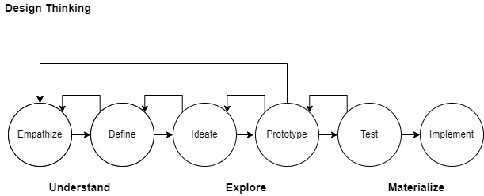

# Application Reference Architecture

## Table of Contents
*Document Generation Date: 2022-05-02 08:05*

* [Application Reference Architecture](#application-reference-architecture)
* [Introduction](#introduction)
* [Definitions](#definitions)
* [Business](#business)
* [Principles](#principles)
* [Application Characteristics and Styles](#application-characteristics-and-styles)
* [Goals for Application Architecture](#goals-for-application-architecture)
* [Goals for Business Architecture](#goals-for-business-architecture)
* [Application Architecture Styles](#application-architecture-styles-1)
* [Patterns](#patterns)
* [Discovery](#discovery)
* [References](#references)
* [Appendix - Definitions](#appendix-definitions)
* [Footnotes](#footnotes)

# Introduction
This document outlines the Application Reference Architecture (ARA) as it applies to our department.  

What is architecture in general?  

- *Architecture is the stuff you can’t Google.* - Mark Richards, O'Reilly
- *Architecture is the decisions that you wish you could get right early in a project, product or project lifecycle* - Ralph Johnson & Martin Fowler
- *Architecture is about the important stuff, whatever that is.* - Ralph Johnson & Martin Fowler

The Application Reference Architecture (ARA) borders on what many would consider an enterprise reference architecture.  This document, the ARA,  attempts to provide an overview of the enterprise environment with a focus on application architecture elements.

This document documents:
- existing application architecture within our department ???
- standards for technical leaders (mandatory)
- guidelines for technical leaders (voluntary)

This document is intended for:
- technical design leads
- technical development team

## Out-of-Scope
- This document is not intended to be a strategy development document.   The ARA is not intended to be a vision, plan or actions towards such a vision.
- The ARA is intended to align and support the many strategies, visions and roadmaps that exist within our department and branch.

# Definitions

This section provides some definitions relating to the application architecture domain in the architecture, platform, framework, platform, and portfolio managements areas.

## Architecture

The following table describes some common terms associated with application architecture.

| Term                               | Definition                                                                                                                                                                                                                                                                                                                                                                                            |
| :-- | :---- |
| Application                        | An application, application program or application software is a computer program designed to help people perform an activity                                                                                                                                                                                                                                                                         |
| Application Architecture (GC EARB) | Application Architecture consists of the interaction of applications with each other and with users. It focuses less on internal mechanics and specific programming and more on the overall design, and how data is consumed and created by the system. It views the interactions between applications, databases, and middleware to ensure scalability, reliability, availability and manageability. |
| Architecture Style                 | The combination of distinctive features related to the specific context within which architecture is performed or expressed; a collection of principles and characteristics that steer or constrain how architecture is formed. (TOGAF)                                                                                                                                                               |
| Architecture Types/Domains         | The overall architecture of an enterprise can be described by integrated sub-architecture domains. These are; Business, Application, Information, Technology, Security, Privacy and Data Architecture                                                                                                                                                                                                 |
| Architecture Characteristics       | Architecture characteristics are the aspects the system must do that are not directly related to the domain functionality. These are often called non-functional requirements but should be considered as Quality Requirements. An architectural characteristic influences some aspect of the design, and is critical to the application's success.                                               |

## Application  Platforms
An application platform provides an environment for software to be executed.

| Platform      | Definition                                                                                              | Example Products                           |
| :-- | :------ | :----- |
| Low Code Application        | A platform which allows for the creation of applications with little to no code.                        | Mendix, ServiceNow, Outsystems, Salesforce |
| Business Process Management | A platform which supports business processes through workflows, processes, orchestration and monitoring | Pega Platform, Microsoft Dynamics          |
| Robotic Process Automation  | A tool which can automate repeated manual tasks.                                                        | uiPath                                     |

## Application Web Frameworks

An web framework is a software framework used by software developers following a standard structure supported by the framework[^StackOverflow-Survey].

| Framework             | Definition                                                                                                                           | Examples                                                                                                                            |
| :-- | :----- | :---- |
| Application Framework | Software framework for enterprise applications                                                                                       | Spring's framework is used to create Java-based enterprise applications.  .Net is a Microsoft-led framework (free and open-source). |
| Front-End Frameworks  | Create and provide the aesthetics, the user experience, and the visual appeal of web applications                                    | React.js, JQuery, Angular, Vue.js                                                                                                   |
| Back-End Frameworks   | Provides the framework for the aspects the user does not see, typcially on a server. APIs, dbs, search, caching are common functions | Nodejs, Spring, Ruby on Rails                                                                                                       |

## Technology Stacks

A technology stack is a set of components (often open-source) bundled together to provide an application development framework.  A stack often has a front-end and back-end aspect with browser, framework, database, server and operating system being specified.

There are many technology stacks.

|Stack|Expansion|
|--|----|
|LAMP|Linux, Apache, MySQL, PHP|
|MEAN|MongoDB, Express, Angular, Node.js|

## Application Components

There are many groups of terms relating to applications and application development.

| Term                 | Definition                                                                                                                                                                                                                                                                                                                                                       |
| :-- | :----|
| API                  | An application programming interface (API) is a connection befferstween computers or ocomputer programs. An API is a software interface, offering a service to other pieces of software.  An API may be a web-service call (REST API, ...) or a software library or framework (function calls, methods, libraries, ...).                                         |
| Front-End & Back-End | In simple application terms, the front-end of an application is concerned with the presentation to the end-user. In simple application terms, the back-end interacts with the data access layer.                                                                                                                                                                 |
| Web Service          | An API to invoke a service over a network.  Many different standards exist for web service APIs (Service Oriented Architecture - SOA and SOAP, REST API, CORBA). gRPC is newer option (2015) using HTTP and ProtoBuf; while more complex than REST APIs, offers programatic interface description language.   gRPC is often used in micro-service architectures. |
| Component, Module, Object | These terms refer to software engineering aspects to identify a software package that encapsulates a set of related functions (or data).[^ComponentSW]|

## Application Portfolio Management
Application Portfolio Management (APM) is used by enterprises to manage the lifecyle of applications.  The key goals of APM are to provide oversight to manage risks, to reduce costs and to make strategic investment decisions.   Some common APM terms are:

|Term|Definition|
|--|----|
|Application Life Cycle (ALC)|The ALC defines the stages of an application.  Four stages are commonly used; 1) governance (decision-making stakeholders decided to create an application; 2) development (the process of creating an application), 3) testing and 4) operations and maintenance.|  
|Technical Debt|Technical debt is the coding you must do tomorrow because you took a shortcut in order to deliver the software today.|
|IT Governance| IT governance is processes that enable the IT staff to better manage risk and operate efficiently to the benefit of the organization.|
|Critical Service|A critical service is one that, if disrupted, would result in a high or very high degree of injury to the health, safety, security or economic well-being of Canadians, or to the effective functioning of the Government of Canada.|

[^StackOverflow-Survey]: StackOverflow's annual survey identifies the top software languages, databases, web frameworks and tools. - [*2021 StackOverflow 2021 Survey*](https://insights.stackoverflow.com/survey/2021#technology)

[^ComponentSW]: [Componet Based Software Engineering - Wikipedia](https://en.wikipedia.org/wiki/Component-based_software_engineering#History)

# Business

The applications that are developed and supported serve one or more business capabilities.  A business transformation or digital transformation often impacts many applications and the integrations between them.  During transformation programs it is important to have a clear understanding of the business's strategic direction.   

The success of an application can be greatly improved with quality business engagement and the development of business architecture artifacts to articulate the strategy and result plan and actions.

Some common artifacts to communicate business architecture are[^Business-1]:

1. Business Glossary
1. Organizational Map
1. Business Capability Model (BCM): A BCM identifies and scores capabilities against good system design quality attributes; namely: performance, scalability, stability, observability, extensibility, security.
1. Process Maps and Re-engineer Processes: Process maps identify what the business does and who is responsible.  [Value streams](https://en.wikipedia.org/wiki/Value_stream) help prioritize areas for improvement.  Model process using Business Process Modelling Notation (BPMN) to optimize processes.
1. Define the Metrics: Identify what metrics the business needs to assess and reflect on desired outcomes. These metrics must be possible to measure and communicate.
1. Understand the Governance Model: In your value stream, ask how decisions are made, who the authorities are, what roles they have, and what relevant review boards are.  This analysis helps identify the components of the governance model.
1. Business Architecture in Applications: What business strategy does this application map to?  Why does this project/application matter?  What new capabilities are you creating?  What major use cases are performed?  Who are the audiences?

## Business Capability Model (BCM)

A common way for the business to communicate what the organization does and needs is through a business capability model (BCM)[^Business-2]. There are many uses for a BCM.   

- Product owners can use a BCM to drive convergence in technology and business processes to enterprise standards.  
- Regular review of aligning the BCM with the department strategy and vision can allow enterprise architects and business architects to identify and prioritize the corresponding IT initiatives with business needs.  
- Internal committees, working groups and forums can collaborate to identify reusable business processes and push for adoption across the organization.  

Business capabilities, processes, information flows and value streams should be assessed routinely based on efficiency, priority, and complexity.

## Process Maps, Information Flows and Value Streams

Information Flows[^Business-4]
: is a business view of how information flows between business responsibility centres. *The main purpose of an information flow diagram is so that sources that send and receive information can be displayed neatly and analyzed.*  

Value Streams
: Introduced in Lean (1950's) a value stream is a set of actions (workflow) to produce value [^Business-3].  Value Stream Mapping is a visual tool introduced in Lean Management methodology to display the value stream with defined icons to show delays and inventory stages.   An example value stream might be recruitment "street to seat", "hire to retire" and "procure to pay".

Process Map
: A Process Map[^Business-5] defines the standard business process, and who is responsible for the activity.  

## Business Governance

Our Corporate Risk Profile (CRP) has identified the risk of our aging IT portfolio.   The health of our portfolio needs to improve.   Several leadership principles have been established over the years to provide guidance when addressing business needs.   

Key business principles relating to governing and directing architecture and application design are: 

1. __Rationalization__:  Application functionality must be constantly rationalized to allow us to tackle the large backlog of valuable business requests and opportunities.   During the software development phase, requirements must be rationalized against the originally approved project scope and other competing for business needs.  The costs of increment application development, both in project costs and ongoing costs must be carefully understood.  This is the process of rationalizing business needs and should include the senior management team when necessary.  [*See Guidance - Rationalization for more information*]

1. __Executive Lead / Change Management__:  Projects and programs need executive sponsors who are committed to embrace change management and the rationalization that is required to allow IT to develop a product.

1. __Business Architecture and Artifacts__:  The business plays a key role in shaping the application feature-set.  Business architecture (capabilities, value streams, information flows, organization model) is essential for successful analysis of the business needs during application development. Significant architecture re-work and design waste result if these are unavailable.  Including the increment improvement of business artifacts during the agile implementation can help derive value from the project.

## Business and Technology Environment
Our Information Technology (IT) operates in a complex and constrained environment due to the sensitivity of information management.  Awareness of the legislative and departmental directives and policies is crucial at the outset of application development.   

A common phrase used in DevOps is to *shift-left* quality attributes like security and privacy.   Key non-functionality quality requirements derived from our environment should be considered at the outset (e.g., official languages act, accessibility act, information management).   The non-functional requirements should be realistic and follow the SMART guidelines (Specific, Measurable, Achievable, Realistic, Time-Bound)[^Business-6].  Product Owners should be encouraged to collaborate with key stakeholders to identify necessary quality requirements throughout the creation of the system.

[^Business-1]: Hewitt, Eben. Semantic Software Design: A New Theory and Practical Guide for Modern Architects, 2020.  - *[ISBN 978-1-4920-4594-6](http://www.worldcat.org/978-1-4920-4594-6)*

[^Business-2]: [Wikipedia - Business Capability Model](https://en.wikipedia.org/wiki/Business_capability_model)

[^Business-3]: [Wikipedia - Value Streams](https://en.wikipedia.org/wiki/Value_stream)

[^Business-4]: [Wikipedia - Information Flow Diagram](https://en.wikipedia.org/wiki/Information_flow_diagram)

[^Business-5]: [Wikipeida - Business Process Maps](https://en.wikipedia.org/wiki/Business_process_mapping)

[^Business-6]: [Wikipedia (SMART) Requirements](https://en.wikipedia.org/wiki/SMART_criteria)

# Principles

## Digital Transformation: Design Principles

The Government of Canada has identified the following digital architecture standards.  There are many sources for digital principles[^Principles-1].    The standards/principles are in support of the Digital Operations Strategic Plan.

Application architecture should include these as over-arching guidelines.

| Principle  | Description   |
| - | ---- |
| Use Open Standards and Solutions by Default          | Open Source, Prioritize (open source, COTS, custom), contribute to open-source                                                                                                                   |
| Maximize Reuse, Reuse and Improve                    | Leverage existing solutions, minimize duplication.                                                                                                                                               |
| Design for Users First                               | User-centered methods, focus on users, using agile.                                                                                                                                               |
| Deliver with Multidisciplinary Teams                 | Include all skillsets required for delivery                                                                                                                                                      |
| Design for Performance, Availability and Scalability | Design quality into the system.  Use distributed systems (assume failure will happen)                                                                                                            |
| Enable Interoperability                              | Expose functionality as a service.  Use microservices built around business capabilities.  Scope each service to a single purpose.  Use APIs.  Use the Canadian Digital Exchange Platform (CDXP) |
| Design Systems to be Measurable and Accountable      | Publish Service Level Agreements (SLAs), Make an audit trail for all transactions (traceability).                                                                                                |
| Keep Data Organized                                  | Decouple master data from applications.  Make systems of record (SOR) authoritative sources, use Master Data Management (MDM)                                                                    |
| Use Cloud First                                      | Use SaaS -> PaaS -> IaaS                                                                                                                                                                         |
| Design for Security and Privacy                      | Categorize data, perform privacy impact assessment (PIA) on personally identifiable information (PII)                                                                                            |

### GC References for Principles and Standards
1. CTO - Government of Canada Digital Standards[^Principles-2]
2. Digital Operations Strategic Plan - 2021-2024[^Principles-DOSP]
3. Directive on Service and Digital[^Principles-DSP]
4. Standards on APIs[^Principles-API]

#### GC DOSP
The GC Digital Operations Strategic Plan[^Principles-DOSP] indicates the priorities for services/applications should be, '*developing and delivering services that, by design, put users first by being accessible, inclusive, secure and easy to use, and that respect privacy and choice of official language*.   

[^Principles-1]: [*Principles for Digital Design*](https://digitalprinciples.org/principles/)

[^Principles-2]: [CTO - Government of Canada Digital Standards](https://www.canada.ca/en/government/system/digital-government/government-canada-digital-standards.html)

[^Principles-DOSP]: [GC Digital Operations Strategic Plan - 2021-2024](https://www.canada.ca/en/government/system/digital-government/government-canada-digital-operations-strategic-plans/digital-operations-strategic-plan-2021-2024.html)

[^Principles-DSP]: [Directive on Service and Digital](https://www.tbs-sct.canada.ca/pol/doc-eng.aspx?id=32601)

[^Principles-API]: [Standards on APIs](https://www.canada.ca/en/government/system/digital-government/modern-emerging-technologies/government-canada-standards-apis.html)

# Application Characteristics and Styles

An different architectural style needs to be chosen depending on the desired architecture characteristics.

TOGAF defines Architecture Style as '*the combination of distinctive features related to the specific context within which architecture is performed or expressed; a collection of principles and characteristics that steer or constrain how an architecture is formed*'.   

## Application Characteristics

The high-level characteristics of the application should be assessed as part of the analysis and design some.  Some of these characteristics may be official documented as part of the project and application development, and others may have to be assumed or derived for requirements.   

- Departmental Application Characteristics: Characteristics that should be defined for all applications and the information/data they manage.
- Quality Characteristics: Quality attributes that significantly impact the architecture should be captured.

### Department Application Characteristics

| Attribute                  | Description                                                                                                                                                                        | Note                                                                                                                                                                                                                                                                                                                                     |
| :-- | :---- | :---- |
| Criticality                | How critical is this application to the business. This is sometimes referred to as Tier-1, 2, 3.                                                                                   | The department lacks an official list of application criticality.   Based on criticality, and TBS guidance, critical applications must have certain quality components like a business continuity plan (BCP) and a Disaster Recover Plan (DRP).  This lists needs to be maintained; and programs established to ensure their ongoing health. |
| Security Profile           | Based on the security triad of Confidentiality, Integrity and Availability (CIA) and indicating the impacts of integrity and availability to the organization (High, Medium, Low). | Common profiles are PBMM (Protected-B, Medium, Medium) and TSHH (Top Secret, High, High).  The security profile can help guide development of quality requirements (non-functional requirements)                                                                                                                                         |
| Information Classification | What classification of information is managed by the system                                                                                                                        | Unclassified, Confidential, Protected A/B/C, Secret and Top Secret are common security classifications                                                                                                                                                                                                                                   |
| IM Repository Type         | Identifies whether the information in this system is transitory or corporate.                                                                                                      | Based on the repository type additional requirements relating to managing the information through its lifecycle are required. Reference [Guideline on Service and Digital](Requirements for departments under the Directive).                                                                                                             |
| Information Business Type  | Our department treats operational information different from administrative information.                                                                                           | The distinction is often unclear. There are few guidelines to help projects to help manage this distinction.   Applications are categorized as managing operational or administrative information.  For example, CW is administrative, CWOPS is operational (however only administrative-operational information is permitted in CWOPS). |

### Quality / Non-Functional Characteristics

Identifying the key quality attributes of the system is required to chose an effective architecture style.  Trade-offs between complexity, scalability, observability, reliability and other attributes is required.  No single architecture style is suitable for all applications.

## Application Architecture Styles

Architectural style is defined as a set of characteristics and features that make a building or other structure notable or historically identifiable. This concepts also applies to application architecture where new styles are being established, and evolving everyday.   Some common application architecture styles are are highlighted below, falling into two broad categories; monolithic and distributed[^Application-1]:

### Monolithic Styles

Layered:  3-Tier / N-Tier / Client-Server
- pros: simplicity and cost
- cons: scalability, fault tolerance, deployability, testability, modularity

Pipeline: pipelines & filters (linux pipes)

- pros: simplicity and cost
- cons: scalability, performance

### Distributed Styles

Microservices Architecture

  - pros reliability, modularity, elasticity
  - cons: cost, complexity

Orchestration - Service Oriented Architecture (SOA) (~2005)

  - pros:  elasticity, fault tolerance, scalability
  - cons: complexity, testability, cost
  - weakness: A big weakness of SOA is the use of a common platform for all services deployed (e.g., Oracle SOA Suite, IBM WebSphere, DataPower, MessageBroker).  SOA also requires stateful services and sharing of context (tight-coupling).
  - promise: While SOA promises loose-coupling, scalability and fault tolerance, however these qualities are difficult to achieve.[^Application-SOA]

Event Driven Architecture
- pros: fault tolerant, modular, good cost
- cons: complexity, testability

[^Application-1]: [Fundamentals of Software Architecture](www.worldcat.org/isbn/978-1-4920-4345-4) : Richards, Mark, and Neal Ford. Fundamentals of Software Architecture: An Engineering Approach. First edition. Beijing Boston Farnham Sebastopol Tokyo: O’Reilly, 2020.

[^Application-SOA]: [Josuttis, Nicolai M. SOA in Practice. 1st ed. Beijing ; Sebastopol: O’Reilly, 2007.](http://www.worldcat.org/978-0-596-52955-0)

# Goals for Application Architecture

The following goals are described in this section.  These goals are aimed at becoming more efficient at releasing applicaitons to production, and, in improving the overall developer exerience (DevEx)

The proceeding section will identify guidance to achieve these goals.

1. Technical Debt Reduction
1. Modular Applications and a Composalbe Enterprise
1. APIs
1. Event Driven
1. Testable Applications
1. Automation
1. Cloud Native - Future Proof Technology
1. User Experience
1. Accessibility
1. Embrace DevOps and Agile

## Goal:  Technical Debt Reduction

Our department's vision includes an *IT Rationalization* pillar which identifies the need to reduce the number of different applications supported by our team.  The Architecture Working Group (AWG) includes principles which address the need to rationalze the portfolio.  

By reducing technical debt our development teams can focus on contributing to high-value projects.  Debt reduction is reduced by the following guidance:

  - Rationalization
  - Reuse / Buy / Build
  - Document & Exercise Backup & Recovery
  - Develop as per the Criticality of the Application
  - Build Less and Stay Lean

### Guidance: Rationalization.

Development of functional and non-functional requirements must be rationalized to help simplify the systems and reduce development and operational costs.   This rationalization requires advocating for change.  There are many strategies to rationalize development to ensure the project can be completed on time, in an agile manner.  Some rationalization guidance recognized by industry leaders include:

  - __Reduce Features__:  "Reduce features, focus on the priorities"[^Rationalize-No]
  - __Focus__: "*Focusing is about saying no.   When you say no, you piss off people.*"[^Rationalize-Focus]
  - __Align to Vision__: "Are we staying true to the vision?"[^Rationalize-Vision]
  - __Prioritize__: Prioritize, Focus on what you really want to deliver), Flexibility : Scope flexibility.  It’s better to make half a product than a half-assed product.[^Rationalize-Prioritize]  
  - __Schedule__: *How does a project get to be a year behind schedule? One day at a time.*[^Rationalize-Schedule]

### Guidance: Reuse / Buy / Build.

  Prior to a business case or project proceeds to development, any new application creation should be discussed with other stakeholders.  If a new application is justified, the options analysis should consider the TBS Digital Standards and GC EARB Application Architecture Standards [^Guidance-5]. In our department this list includes:

  - TMO - Transformation Management Office,
  - BRMO - Business Relationship Management Office,
  - TRB - Technology Review Board and the
  - AWG - Architecture Review Board).     

  The following priorities for options analysis:

  - __Reuse__:  Attempt to reuse what we currently own, or what other government departments / partners are using.     
  - __Buy__: Buy solutions and integrate into our enterprise architecture
  - __Build__:  As a last resort, custom build a solution.  This should be limited to business capabilities and processes that are unique to our department.  Executive approval (Department Architecture Review Board - DARB)  required.

### Guidance: Document &amp; Exercise Backup &amp; Recovery

  All applications, regardless or criticality, must have a documented backup and recovery procedure.   The procedure must be exercised on a regular basis (at least annually) and must be done prior to deployment to production.

### Guidance: Develop as per the Criticality of the Application

  Business critical applications require a Business Continuity Plan (BCP) and Disaster Recovery Plan (DRP) to be documented and reviewed on a regular basis.   The DRP must be exercised routinely.

  - [ ] Enterprise Architecture Gap : Formally identification of critical applications is not available.  A formal list of application must be captured and recorded in the department's official configuration management database (CMDB).  

    - Note: *As of this writing the CMDB is not the official source of truth for the list of critical applications.  In the interim, projects should clearly identity application criticality and allow for analysis and design of the quality attributes required for critical applications.*

### Guidance: Build Less and Stay Lean

  BaseCamp, a project management software provider, has a few short-narratives on ways to stay-competitive; which can be adopted to our department attempting to reduce technical debt.

  - [Basecamp - The Starting  - Build Less](https://basecamp.com/gettingreal/02.1-build-less):

    - Less features
    - Less options/preferences
    - Less people and corporate structure
    - Less meetings and abstractions
    - Less promises  

  -  [Basecamp - Stay Lean - Less Mass:](https://basecamp.com/gettingreal/03.1-less-mass)
      - Less "Thick process"
      - Less "Long-Term Roadmaps"  (supported as by our ITSS Study - Ian Lovison 2017)
      - Less of "The past ruling the future"

## Goal:  Composable Enterprise, Composable Applications

A composable application is a key pattern in micro-services.   In our current environment and infrastructure environment, the focus should be on designing *single purpose services" on virtual machines.   Applications should be thought of as thin user interfaces on top of this collections of services.  The design of the services/APIs is important to success of the project and application.  Some guidance to help in the design and communication of the service-architecture are:

- Domain Drive Design
- Standards on API (Government of Canada)
- Decouple User Interfaces - Backend-For-Front-End (BFF)
- SOLID Design Principles

### Guidance: Domain Drive Design (DDD) / Bounded Context[^Guidance-11]

DDD is useful for large transformation and modernization projects like HR and ERP modernization.   DDD is complex, however understand some core-concepts can help in developing modular applications.  Within DDD, a bounded-context defines core boundaries of a sub-domain.  The bounded-context helps identify what features and data models are in its responsibility, and, equally as important what is beyond it's context.  Within this bounded-context services can be designed and exposed.  

A quick summary of DDD is to:

1. identify domains and identify the data model this domain manages (high-cohesion).
2. Expose functionality via services in a modular manner (loose-coupling).

Refer to *Domain Driven Design*[^Guidance-12] for details on this concept.

### Guidance: Use APIs

  The Directive on Service and Digital[^Guidance-13] provides high-level guidance on API design summarized below:

- __Business-Based APIs__:  Build APIs against business requirements
- __Collaborate__: Work with the developers who are expected to consume your API
- __Standardized__: Expose APIs using industry accepted open standards

### Guidance: Decouple User Interfaces

Design the web UI to work across ~~mobile devices, tablets, and~~ desktops at a minimum.  Text is ~~striked-out~~ to indicate we currently develop applications for use on a known standard-provisioned desktop with two-monitors; ideally supporting Edge and Chrome.

1. APIs, and the consuming services/applications should have *high-cohesion* and *loose-coupling*.  This is especially important as software communicates across business domains.   
1. APIs should be used to reduce; especially at the high-level interactions between components.[^Guidance-1],[^Guidance-2],[^Guidance-3].

Architectural patterns to support composable applications include:

High Cohesion
: Cohesion can be measured in terms of functional, communication, procedural, logical and other dimensions.[^Guidance-4]

Low Coupling
: Use data access layers between application business logic and the database layer.  Coupling is more difficult to understand and requires assessment of connascence[^Guidance-14].

Some common guidelines are:

- break system and APIs into encapsulated replacements
- minimize any connascence between systems (dependency relationships between objects)

### Guidance: S.O.L.I.D. Software Design[^Guidance-15]

SOLID is five design principles supporting composable applications.   Some of the principles date back 30 years.

Rigid adherence to SOLID is not the objective.  What is important is for developers to understand the value of these, and when to use them effectively.  This article[^Goals-1] provides an excellent description of the value of each principle.   

  - S - Single Responsibility Principle. Gather together things that change for the same reason, and separate things that change for different reasons.  Good system design means that we separate the system into components that can be independently deployed.

  - O - Open–closed principle - Software entities and components should be open for extension, but closed for modification.

  - L - Liskov substitution principle - Objects in a program should be replaceable with instances of their subtypes without altering the correctness of that program. Design by Contract.

  - I - Interface segregation principle - Many client-specific interfaces are better than one general-purpose interface.

  - D - Dependency inversion principle - One should "depend upon abstractions, *not* concretions.

### Guidance: 12-Factor Application

The *12-Factor Applications*[^Guidance-16] was defined by Heroku in 2011 as a means to define attributes or a successful Software as a Service (SaaS) application with portability and resilience characteristics.  These characteristics are good goals for the software architecture to achieve.

  1.  Codebase: There should be exactly one codebase for a deployed service with the code base being used for many deployments.
  1.	Dependencies: 	All dependencies should be declared, with no implicit reliance on system tools or libraries.
  1.	Config:	Configuration that varies between deployments should be stored in the environment.
  1.	Backing services:	All backing services are treated as attached resources and attached and detached by the execution environment.
  1.  Build, release, run:	The delivery pipeline should strictly consist of build, release, run.
  1.	Processes:	Applications should be deployed as one or more stateless processes with persisted data stored on a backing service.
  1.	Port binding:	Self-contained services should make themselves available to other services by specified ports.
  1.	Concurrency:	Concurrency is advocated by scaling individual processes.
  1.	Disposability:	Fast startup and shutdown are advocated for a more robust and resilient system.
  1.  Dev/Prod parity:	All environments should be as similar as possible.
  1.	Logs:	Applications should produce logs as event streams and leave the execution environment to aggregate.
  1.	Admin Processes:	Any needed admin tasks should be kept in source control and packaged with the application.

## Goal: Improved API Developer Experience

Our department's developers have inadequate guidance and tooling to build API's effectively and efficiently.  API's are a critical component of our technology stack.  The API strategy needs to mature as applications integrate more-and-more through API's.

As per the GC DOSP, our department needs to develop an API Strategy.  The API Strategy should address concerns such as:

- API Discovery / Catalog:  Provide tools to allow developers to discover integrations amd APIs?
- API Testing: automated testing, performance testing, stubbed-out testing.
- The following GC, NZ and UK API guidance documents are written to support integrating digital processes across departments and agencies.   Their guidance is relevant for internal integrations.

  - [GC Standards on API](https://www.canada.ca/en/government/system/digital-government/modern-emerging-technologies/government-canada-standards-apis.html) guidance,
  - [NZ API Guidance & Resources](https://snapshot.ict.govt.nz/guidance-and-resources/standards-compliance/api-standard-and-guidelines/api-standard-and-guidelines-part-b-technical/)
  - [UK API Technical & Data Standards](https://www.gov.uk/guidance/gds-api-technical-and-data-standards)   

### Guidance:  Develop and API Strategy

Develop an enterprise API Strategy to help mature our API approach and improve our ability to integrate systems.  API documentation, using standardized protocols and providing API management are aspects of the strategy.

1. [API Documentation](https://www.gov.uk/guidance/how-to-document-apis): discover, affordances (understand how to use API), integration with API.  Examples: [GOV.UK Frontend](https://frontend.design-system.service.gov.uk/?_ga=2.152481273.1904569585.1642645779-431822512.1642645779#gov-uk-frontend), [Stripe API](https://stripe.com/docs/api), [Mailchimp](https://mailchimp.com/developer/).
1. API Protocols: Leverage protocols and languages like gRPC and GraphQL for integrations.
1.  API Management / Service Mesh: As the number of components, micro-services and integrations grow, the need for an API management layer to provide orchestration and API lifecycle management increases.  API management provides a single point of entry for all connected systems and services.  API Management also helps developers (IT, client-authentication, authentication, business-citizen) develop to APIs.  API Service Mesh are common in microservices architectures.[^API-ServiceMesh]

## Goal: Testable Applications

Testing applications and groups of applications effectively and efficiently requires planning, analysis and design.  The application development cycle must include developing capabilities to facilitate testability.  Testing scopes vary based on developer testing and quality assurance testing.  QA testing often involves elaborate efforts to setup a system (install, configure and provision) for a single test case.  

The architectural goal is to build testability into applications.  Testable applications  enhance the reliability and security of applications.

The desired outcomes of this guidance is to:
1. Modular Testsuite: have a suite of automated testing that can be executed at modular levels on a component(s) or system
1. Toolsets for Testing: toolsets to help in the setup, data-loading and test-validation of test suites
1. Continual Testing: integration of testcases into the CI/CD pipeline
1. Version Controlled Tests: a library of version-controlled testcases available for agile teams to use

### Guidance : Shift-Left Testing

The guidance is to adopt the [*Microsoft - Shift Left Testing*](https://docs.microsoft.com/en-us/devops/develop/shift-left-make-testing-fast-reliable)) DevOps of automation while shifting-left the integration and quality testing.  Automation should accommodate the CI/CD concepts, as well as the ability to provision and validate tests across multiple environments.  The shifting left of testing improves release cycle planning, allows more predictability on product quality and reliability

The following principles are copied from Microsoft Shift Left Testing[^Guidance-6]:

  - __Low Level Tests__: Write tests at lowest level possible.  Favour unit tests over functional tests.   When functional tests fail, consider if unit tests should be more comprehensive.
  - __Reusable Tests__: Write-once, run anywhere (DRY - Do Not Repeat yourself):  Tests should be written to work in any environment (Dev, Sig, Prod) by consuming configuration of the environment.
  - __Design Product for Testability__.   Discuss how the system is testable during peer-reviews and Technology Review Board (TRB) reviews.  Include these user-stories early in the agile development cycle (Shift-Left)
  - __Test Code is a product__.  Treat the software used to automate testcases as code.  The code is version-controlled, and discoverable (i.e., it exists in close proximity to the application code
  - __Test ownership follows application software ownership__.  The software development team owns creating automated tests for not only unit-tests but boundary/integration tests.  Embrace the DevOps mentality of owning the system through to production deployment.  

Recommendation:

- [ ] SDLC Checklist: FY 22/23:  The Quality Assurance Working Group and the SDLC Working Group should consider formalizing the above principles and guidance as part of the new SDLC process, milestones and checklist.

### Guidance : Test-Driven Development

Adopt development methodologies like test driven development (TDD) that predates DevOps.   How TDD and DevOps are related is well described in the article '*TDD for a DevOps World*[^Guidance-7] - summary:

- TDD is clearly a quality enhancing practice.
- TDD is an effective way to mitigate the risks of defects.
- TDD increases the chances of actually achieving the resilient and rugged code that needs to withstand the increasing demands of a DevOps world where expectations are much higher.

Caution:  Although directed by the TBS Playbook Towards EARB, TDD can be burdening on a development process.  Ensure, TDD  is applied in meaningful areas.

## Goal: User Experience

Our user experience can be improved by looking at modern applications and their integration into varying computing platforms (desktop, mobile, tablet).  

User-experience is an entire-profession.  User-experience is the experience of a user as they interact with the system and the perception they feel throughout and after the interaction.   Understand usability, affordances and other behaviours is important.  Some resources include:

  - [Nielsen-Norman Group (NNG) - User Experience](https://www.nngroup.com/)
  - [Usability.gov - User Centric Design](https://www.usability.gov/what-and-why/user-centered-design.html)
  - Government of Canada - Digital Standards - Design with Users[^Guidance-25]
  - [McKinsey - Business Value of Design](https://www.mckinsey.com/business-functions/mckinsey-design/our-insights/the-business-value-of-design#)
  - [Role of a Ux Design in an Agile Product Team](https://uxdesign.cc/the-role-of-the-sole-ux-designer-in-an-agile-product-team-497afa8d04ff): Desirability, Viability and Feasibility trade-offs

User experience and user design is an entire profession.

Some modern experiences can include:
- Push Notifications:  Business fit-for-purpose notifications using the [Push API](https://developer.mozilla.org/en-US/docs/Web/API/Push_API) and integrated into the Windows Operating System experience.  Replace mindset of email-based notifications into a notification platform with end-user ability to control notifications.
- Sharing Content Across Platforms:  Ability to share content across platforms similar to sharing news and social-media content.  Allows the ability to communicate effectively in different channels (intranet, CMS, ...).  *[oEmbed](https://oembed.com/)* is one standard for sharing content across platforms with a linkable visual.

There are many modern application experiences users expect in an application.  A short checklist of modern user experience functions relating to presented content are:

- social like : can the content be liked to identify high-value content
- share : does it make sense to have a *share* button to allow sharing with collegues while enforcing access as appropriate
- link : should it be possible to get a link to the content for sharing, bookmarking, reporting.   What are the guarantees on the provided link (transitory, corporate, survives upgrades, ...)
- discuss/comment : can comments be provided for all to see, or to raise a concern to the author (private comment)
- rich link embed : when embedding a link in another application, should a link-preview be provided

### Guidance: Include Ux Design in Agile Product Teams

- [ ] Agile development teams should include user-experience design resources.
- [ ] Agile iterations iterations should include user-experience user-stories.
- [ ] Product teams should plan for iterations for both the user-experience development and the usability testing phases.

## Goal: Accessibility

The Accessible Canada Act received Royal Assent on June 21, 2019, and came into force on July 11, 2019.[^Accessibility]   

In light of no departmental policy, applications should strive to achieve WCAG 2.1 Level AA.  This goal changes by application, and development must ensure they are aware of the business requirements for accessibility.  

WCAG 2.1 Level AA (Double-A) implies:

- Media: Captions are present on live video.  When appropriate, there exists audio description of what’s happening on streaming media.
- Markup: Ability to resize text without breaking layout.  Language is declared in document.
- Design: A minimum contrast of 4.5:1 among elements. Heading tags (h1,h2,h3, etc.) are present and emerge from content organically.
- Forms: If an error is present on a form, the website will: suggest ways to fix it, the user may withdraw and resubmit the form, or the form prompts a confirmation.
- Navigation: Pages can’t be nested or unintentionally obfuscated unless part of a step-by-step process, such as an application or feed result. Navigation follows a semantic structure and is repeated on pages.

### Guidance: Establish Baseline Accessibility Targets for Application

A basic checklist of minimal accessibility guidelines are:

- [ ] Applications should meet WCAG 2.1 Level AA success criteria.
- [ ] Applications should allow users to self-identity accessibility needs through an application profile setting.
- [ ] Applications should be tested for accessibility, including, testing functionality with our accessibility tool suite (page readers, etc)
- [ ] Application develop and product teams must establish accessibility early in develop cycle interactions.  Shift-left accessibility.

## Goal: Embrace DevOps and Agile

Agile and DevOps are modern methodologies that have proven to be successful in business and in modern complex application development.   Agile provides a dynamic, engaging experience for the IT and business teams.  The GC has directed departments to use agile methodologies.

Some principles of Agile DevOps are highlighted below.   

From [DevOpsAgileSkills](https://www.devopsagileskills.org/dasa-devops-principles/):

1. Customer-Centric Action : Short iterations with real-clients
1. Create with the End in Mind : All employees need to see the big picture, and break down role boundaries
1. End-To-End Responsibility : Create teams which support the operations behind what the team hasa developed; *DevOps*!
1. Cross-Functional Autonomous Teams : Fully responsible teams for the product's lifecycle
1. Continuous Improvement : Experiment, iterative, fail, improve.  
1. Automate Everything You Can : Automate software and infrastructure.  Use containers.

From [Coursera - DevOps Culture and Mindset](https://www.coursera.org/lecture/devops-culture-and-mindset/the-westrum-model-for-improving-organizational-culture-8HXtP)

1. __Eliminate Waste__ : Don't code more features than needed.   Aligns with rationalization principle.
1. __Build Quality In__ : Quality is everyone's responsibility.  Verify quality is built into product and process.
1. __Create Knowledge__ : Amplify learning.  Development is constant learning. Create blogs, videos, team-onboarding tutorials, leverage hands-on training environments.
1. __Defer Commitment__ : Make decisions at the right time, with analysis and considerations.  Defer decisions until you have more information.  Understand impact of decisions.   ''*Take your time. When the decision is irreversible, give yourself time and space to think it through. When the decision is easily reversible, don't overthink it.*' - *[Dries - Drupal - Decisions](https://dri.es/principles-for-life)*
1. __Deliver Fast__ : Ensure feedback received early and often allowing to change and adapt.  Deliver in smaller batches which will allow you to deliver faster.
1. __Respect People__ : Lean and DevOps rely on a culture of respect.
1. __Optimize the Whole__ : Employ Systems Thinking.

### Guidance : Adopt Agile and DevOps

Our department is maturing with agile.  A checklist to assess a few aspects of Agile are:

- [ ] The Agile team has all skillsets needed for the product development and operations.
- [ ] The team is delivering to production in an interative manner
- [ ] Team members are dedicated to the development, and, context-switching is minimized through the use work-in-progress limits.

## Goal: Cloud-Native - Future Proof Technology

The [MACH Aliance](https://machalliance.org/)[^Guidance-8] was announced in December 2021.  AWS, MongoDB and others are associated with this alliance.  This alliance defines the strategy for a best-of-breed enterprise technology ecosystem.  MACH is container and  micro-service focused.   MACH does identify key-concepts for use within our data-centre applications; namely modular, API-based and headless.  T

This manifesto is "*Future proof enterprise technology and propel current and future digital experiences*". MACH aligns with the GC EARB directions[^Guidance-5]:

- __M__: Micro-Services (Modular): Individual pieces of business functionality that are independently developed, deployed, and managed. A swappable architecture.
- __A__: API: All functionality is exposed through an API.
- __C__: Cloud: SaaS that leverages the cloud, beyond storage and hosting, including elastic scaling and automatically updating.
- __H__: Headless: Front-end presentation is decoupled from back-end logic and channel, programming language, and is framework agnostic.

his alliance is for cloud-native applications (CNA), and is worthwhile reading for CNA development.  Our constraints may limit our ability to leverage the cloud.  For on-premise constrained systems DevOps practices to automate updating and Kubernetes auto scaling should be prioritized.  A view of how MACH applies to guidance and industry patterns is below.

|MACH|Description|ARA Guidance|Industry Patterns|
|--|--|--|--|
|M - Microservices|Individual *pieces* of business functionality can be deployed and managed|Composable Applications|[Microservices Architecture Style](https://learning.oreilly.com/library/view/fundamentals-of-software/9781492043447/ch17.xhtml)|
|A - API|Functionality exposed via API|Composable Applications|GC API-First, [GC Standards on API](https://www.canada.ca/en/government/system/digital-government/modern-emerging-technologies/government-canada-standards-apis.html)|
|C - Cloud|Leverage SaaS to its fullest including scalability and automation|Security / Policy Restricted|Aligned to MACH|
|H - Headless|Decouple front-end from back-end|Cohesive, Loosely-Coupled Applications, Services and APIs|[Accenture](https://www.accenture.com/nl-en/blogs/insights/headless-architecture-why-its-becoming-the-new-normal)|

Aside:  An interesting article, *MACH Sitecore Architecture*[^Guidance-10] on how a Content Management System (CMS) is attempting to become MACH-compliant; with discussion on impacts to CMS features like editors, and the use of technologies like JAMstack; a static-site generator (SSG) framework.

[^Rationalize-No]: [Basecamp - Feature Selection - Start with No](https://basecamp.com/gettingreal/05.3-start-with-no)

[^Rationalize-Focus]: [Steve Jobs - Focus on Saying No - 1997](https://www.youtube.com/watch?v=H8eP99neOVs)

[^Rationalize-Vision]: [Basecamp - Priorities - Whats the Big Idea](https://basecamp.com/gettingreal/04.1-whats-the-big-idea)

[^Rationalize-Prioritize]: [Basecamp - The Starting Line - Fix Time and Budget, Flexibility on Scope](https://basecamp.com/gettingreal/02.4-fix-time-and-budget-flex-scope)

[^Rationalize-Schedule]: [Fred Brooks 1979 Software Project Management - The Mythical man Month](https://en.wikipedia.org/wiki/The_Mythical_Man-Month). [Book](http://www.worldcat.org/isbn/0-201-00650-2)

[^Guidance-1]: [Reduce Coupling - Martin Fowler IEEE 2002](https://www.martinfowler.com/ieeeSoftware/coupling.pdf).

[^Guidance-2]: [Amazon-AWS Bezos API's - Expose Data and Functionality through service interfaces](https://blog.apievangelist.com/2015/07/09/the-new-aws-api-gateway-anyone-who-does-not-do-this-will-be-fired-thank-you-have-a-nice-day-jeff-bezos/)

[^Guidance-3]: [Mastering API Architecture](www.worldcat.org/isbn/978-1492090632)

[^Guidance-4]: [Fundamentals of Software Architecture](www.worldcat.org/isbn/978-1-4920-4345-4) : Richards, Mark, and Neal Ford. Fundamentals of Software Architecture: An Engineering Approach. First edition. Beijing Boston Farnham Sebastopol Tokyo: O’Reilly, 2020.

[^Guidance-5]: [GC EARB EA Standards and Application Architecture](https://wiki.gccollab.ca/GC_Enterprise_Architecture/Standards/Application_Architecture)

[^Guidance-6]: [Microsoft - Shift Left Testing](https://docs.microsoft.com/en-us/devops/develop/shift-left-make-testing-fast-reliable)

[^Guidance-7]: [TDD for a DevOps World](https://medium.com/swlh/revisiting-test-driven-development-for-a-devops-world-401f1f8d3275)

[^Guidance-8]: [MACH Aliance](https://machalliance.org/)

[^Goals-1]: [Devopedia - SOLID Design Principles](https://devopedia.org/solid-design-principles)

[^Guidance-10]: [MACH Sitecore Architecture](https://www.verndale.com/insights/emerging-technology/hitchhikers-guide-to-sitecore-architecture-in-2022)Guidance

[^Guidance-25]: [CTO - Government of Canada Digital Standards](https://www.canada.ca/en/government/system/digital-government/government-canada-digital-standards.html)

[^Guidance-11]: [Martin Fowler - Bounded Context](https://www.martinfowler.com/bliki/BoundedContext.html)

[^Guidance-12]: [Evans, Eric. Domain-Driven Design: Tackling Complexity in the Heart of Software. Boston: Addison-Wesley, 2004.](www.worldcat.org/isbn/978-0321125217)

[^Guidance-13]: [Appendix B to Directive on Service and Digital - Mandatory Procedures for APIs](https://www.tbs-sct.canada.ca/pol/doc-eng.aspx?id=32604)

[^Guidance-14]: [Wikipedia - Connascense](https://en.wikipedia.org/wiki/Connascence)

[^API-ServiceMesh]: [API Management and Sevice Mesh Checlist - Redhat](https://www.redhat.com/en/resources/api-management-and-service-mesh-checklist)

[^Accessibility]: [Accessibility Act - Summary](https://www.canada.ca/en/employment-social-development/programs/accessible-people-disabilities/act-summary.html)

[^Guidance-15]: [Martin, J. Principles of object-oriented analysis and design. (Prentice-Hall, 1993)](http://www.worldcat.org/isbn/978-0-13-720871-5)

[^Guidance-16]: [12-Factor Application - Heroku - 2011](https://en.wikipedia.org/wiki/Twelve-Factor_App_methodology)

# Goals for Business Architecture

Although beyond the scope of this document, product development can be vastly improved when business architecture is developed alongside the application. This section provides some high-level guidance and references Government of Canada directions as appropriate.

## Guidance: Create an Business Architecture Strategy

Product development methodologies include business architecture as a key domain contributing to the overall success of a product.   The TBS Playbook Towards EARB starts with the business domain.  The architectural strategy for a program; whether they are renewal efforts (ERP, HR, IM, Collaboration) or greenfield (Case Management) should create business domain work products.

The following artifacts, described earlier in the *Business* section, can be evolved throughout the agile product development by the inclusion in sprint cycles and demonstrations.

1. Business Glossary
1. Organizational Map
1. Business Capability Model (BCM)
1. Process Maps
1. Business Metrics
1. Governance Model
1. Business Architecture in Applications

## Guidance: Incorporate Design Thinking in Transformation Programs

Use design-thinking in the cross-functional project team to arrive at appropriate architectures.   The steps in design thinking are:

1. Define the Problem
1. Make Observations : determine users, observe user's actions, create personas
1. Form Insights
1. Frame Opportunities
1. Generate Ideas
1. Refine Solutions
1. Try Prototypes

### Design thinking principles:
1. Human-centricity
1. Showing, not-telling
1. Clarification
1. Experimentation
1. Collaboration

## Guidance: Incorporate Systems Thinking in Transformational Programs

Systems Theory in engineering considers both the business and the technical needs of all customers, with the goal of providing a quality product that meets the user's needs.   

Systems Thinking, draws on this theory, and provides a perspective of seeing and understanding systems as wholes rather than as collections of parts. A whole is a web of interconnections that creates emerging patterns. – [Peter Senge](https://en.wikipedia.org/wiki/Peter_Senge) and the book [The Fifth Discipline - 1997](https://en.wikipedia.org/wiki/Peter_Senge)

Why use Systems Thinking?
- To find the most important places for intervention to change the long‐term behaviour of a system.
- Systems thinking is based on user-centric design principles.  
- Government of Canada Digital Operations Strategic Plan directs departments to use user-centric design.
- Government of Canada Digital Standards directs departments to design with users.

Systems Thinking - 4 Fundamental Concepts
1. Interconnectedness
1. Synthesis
1. Feedback Loops
1. Causality

Analysis : Analysis Is about dissection of complexity into manageable components. Analysis fits into the mechanical and reductionist worldview, where the world is broken down into parts. - *Analysis looks into things.*

Synthesis : Is about understanding the whole and the parts at the same time, along with the relationships and the connections that make up the dynamics of the whole. - *Synthesis looks out of things.*

Approach
1. Identify a system
1. Explain the behaviour or properties of the whole system (Synthesis)
1. Explain the behaviour or properties of system components (Analysis)

Questions to ask:
1. What depends on what?
1. What is causing what?
1. Where are the information flows?
1. Where control decisions are made?
1. What information flows are critical?
1. How to best engage stakeholders?
1. How best to manage or intervene in the system for desired result?

Tools
1. brainstorming tools
1. dynamic thinking tool
1. structural thinking tools
1. computer based tools

# Application Architecture Styles

## Big Ball of Mud - Anti-Pattern:

A "Ball of Mud" application is an application without structure, software making direct database calls, with no concerns for design.  In 1997, Brian Foote and Joseph Yoder, coined this the Big Ball of Mud:

  *A Big Ball of Mud is a haphazardly structured, sprawling, sloppy, duct-tape-and-baling-wire, spaghetti-code jungle. These systems show unmistakable signs of unregulated growth, and repeated, expedient repair. Information is shared promiscuously among distant elements of the system, often to the point where nearly all the important information becomes global or duplicated.*

The overall structure of the system may never have been well defined.

Our department has an abundance of *ball of mud* applications.

## Event Driven Architecture Patterns

Event Driven Architecture (EDA) is a architecture pattern based on the production, detection, consumption of, and reaction to events.  This architectural style is extremely useful in distributed systems for scalability and performance.  EDA architectures are not simple, nor are they easy to test.  EDA leverages the Publish/Subscribe Enterprise Integration Pattern[^EIP]

### Request-Response communication has the following characteristics:
- Low latency
- Typically synchronous
- Point-to-point, or, via broker/gateways
- “Bespoke API”
- e.g. HTTP, SOAP, gRPC

### Event streams are based on these concepts:
- Messaging / Pub Sub (sending data from A to B and C)
- Continuous data processing (filtering, transformations, aggregations, business logic)
- Often asynchrounous
- Event-driven, supporting patterns like Event Sourcing and CQRS
- General-purpose events
- e.g. Apache Kafka

### EDA Integration Patterns
- single partition / single consumer : simple pattern, provides ordering, but due to a single partition does not scale
- single partition / multiple consumer : fan-out, sharing events with multiple consumers
- at-least once delivery : product ensures message is committed by the delivery mechanism.  
- multi-partitions / multi-consumers : ordering is by partition, consumers must understand partition ordering

[^EIP]: [Hohpe, Gregor, and Bobby Woolf. Enterprise Integration Patterns: Designing, Building, and Deploying Messaging Solutions. The Addison-Wesley Signature Series. Boston: Addison-Wesley, 2004.](www.worldcat.org./isbn/978-0321200686)

# Patterns
Patterns are known, proven solutions.  Patterns help us communicate architecture and design to each other.

Drive strategy with patterns.

Patterns are used at different layers and perspectives; such as:

- software design patterns : Decorator, Factory, Visitor, Pub/Sub, ..
- user experience patterns

## Software Design Patterns
In software engineering, a software design pattern is a general, reusable solution to a commonly occurring problem within a given context in software design.  There are many great books on software design patterns.  Wikipedia's Software Design Patterns[^Pattern-3] is a good resource.

Famous design pattern books include:

- 1995 - Design Patterns: Elements of Reusable Object-Oriented Software[^Pattern-4] : Define a set of creational, behavioural and structural software patterns like builder, factory, facada, bridge, mediator, command and observer.
- 2003 - Fowler - Patterns of Enterprise Application Architecture[^Pattern-5] : Defines many categories of patterns including Domain, Data Source, Web Presentation, Distribution, Offline, and Session State Patterns.  Specific patterns include data gateway, model-view-controller, and client session state.

## User Interface Patterns
Many patterns exist for a successful user-experience (search, navigation, filters, comparisons, grids, ...)
- [Blueprints by CodePros - Patterns](http://tympanus.net/codrops/category/blueprints/) : The Blueprints are a collection of basic and minimal website concepts, components, plugins and layouts with minimal style for easy adaption and usage, or simply for inspiration.

- [Google Material UI](https://material.io/search.html?q=pattern) : An extensive library of UI patterns including [Search](https://material.io/archive/guidelines/patterns/search.html), Navigations, On-boarding and other common use-case patterns.

## Business Patterns

Caveman Pattern
: Reliving old problem experience with new projects even though the risk is extremely low.  (O'Reilly Fundamentals of SW Architecture)

Conway's Law
: Conway's Law asserts that organizations are constrained to produce application designs which are copies of their communication structures. This often leads to unintended friction points. The [*Inverse Conway Maneuver*](https://www.thoughtworks.com/radar/techniques/inverse-conway-maneuver
) recommends evolving your team and organizational structure to promote your desired architecture. Ideally your technology architecture will display synergies with your business architecture.

## Cloud Design Patterns

1. [Microsoft Azure Cloud Design Patterns](https://docs.microsoft.com/en-us/azure/architecture/patterns/)
1. [AWS Prescriptive Guidance Patterns](- [AWS Prescriptive Guidance Patterns](https://docs.aws.amazon.com/prescriptive-guidance/latest/patterns/welcome.html)) : 2,000 pages of patterns for cloud, DevOps, communication, testing, governance, IoT, Security, Serverless, Spark, ETL, A/B Testing, Canary Testing, ...

## Microservices Patterns
Sam Newman's book, "Building Microservices, Defining Fine-Grained Systems"[^Pattern-1] defines many patterns, including patterns to migrate from monoliths to microservices.   These patterns include:

  - Strangle Fig Pattern: . You intercept calls to the existing system—in our case the existing monolithic application. If the call to that piece of functionality is implemented in our new microservice architecture, it is redirected to the microservice.
  - Saga Pattern
  - References legacy Enterprise Integration Patterns (EIP)[^Pattern-2]
  - Backend for Front-End (BFF) : similar to an aggregating gateway, but limited to a single user-interface.  For example have a BFF for an Android vs Apple client.

References for microservices patterns:

  - [Sam Newman Patterns](https://samnewman.io/patterns/)
  - [Martin Fowler](https://martinfowler.com/)

[^Pattern-1]: [Building Microservices - Sam Newman](www.worldcat.org/isbn/978-1492034025)

[^Pattern-2]: [Hohpe, Gregor, and Bobby Woolf. Enterprise Integration Patterns: Designing, Building, and Deploying Messaging Solutions. The Addison-Wesley Signature Series. Boston: Addison-Wesley, 2004.](www.worldcat.org./isbn/978-0321200686)

[^Pattern-3]: [Wikipedia - Software Design Patterns](https://en.wikipedia.org/wiki/Software_design_pattern)

[^Pattern-4]: [Design Patterns: Elements of Reusable Object-Oriented Software](www.worldcat.org/isbn/0-201-63361-2)  : Gamma, Erich, ed. Design Patterns: Elements of Reusable Object-Oriented Software. Addison-Wesley Professional Computing Series. Reading, Mass: Addison-Wesley, 1995.

[^Pattern-5]: [Fowler - Patterns of Enterprise Application Architecture](www.worldcat.org/isbn/978-0-321-12742-6) : Fowler, Martin. Patterns of Enterprise Application Architecture. The Addison-Wesley Signature Series. Boston: Addison-Wesley, 2003.

# Discovery

There are many initiatives within our department that require enterprise and domain architecture effort to recommend the path forward.  The below are a few initiatives that could serve as enablers for improved application development in the future.

## Identity and Access Management (IdAM)

Analyze existing identity and access management options to provide multi-domain identity and access to highly  compartmentalized information.  Identify options for securing compartmentalized information while allowing information to be easily shared across business-domains (operational data and operation administration).  

For example, research patterns on how *drag-and-drop* be simplified when dragging a secured-object into another collaborative application.   How can this be done in a user-friendly manner while respect the security constraints?  There are no known industry patterns for this (e.g., Google's Zanzibar for photo-sharing lacks the features required in our drag-and-drop problem space).

## Multi-Security Zone Applications

Our directorate has been asked to to move workloads to lower security zones.  This has the potential of reducing the security requirements for the systems and enabling more work-from-home opportunities.  As a consequence business processes may span security zones.  The cross-domain-solution has been identified as an enabler technology.  What overall application, data, information and security architecture is needed to realize these benefits?   

## Managing Media

Our department manages multimedia (images, audio and video files) as well as file-types on a diverse range of applications.  Media management can be addressed be a Media Management Platform and a Digital Experience Platform (DXP).  Industry leaders include OpenText, Oracle and Salesforce.  While some Content Management Systems (CMS) also support DXP features many new market entrants are SaaS-based and require cloud connectivity (e.g, Sanity.io).   

OpenText DXP is not in the top-magic quadrant; however it deserves consideration since GCdocs being based on OpenText and the Government of Canada has many employees familiar with the technology.

- [Opentext Why you Need a DXP](https://blogs.opentext.com/digital-experience-platform/): *Orchestrating a cohesive, contextual experience that meets brand standards, achieves business goals across all channels and touchpoints, while it delights the recipient, is a massively difficult task.*

Features of a DXP:
- Content Management System
- Media Asset Management
- Digital Asset Management (media and non-media content)
- Headless DXP / CMS : Provide back-end features expose media assets via API's.

# References

## Architecture

- [Richards, Mark. & Ford, Neil. Fundamentals of software architecture: an engineering approach. (O’Reilly, 2020)](http://www.worldcat.org/isbn/9781492043454)

## Cloud

- [*Cloud Security Alliance - The Six Pillars for Cloud SecDevOps](https://cloudsecurityalliance.org/group/DevSecOps/)

## Design

### Systems Thinking : Human-Centric Design

- [System Thinking](https://en.wikipedia.org/wiki/Systems_thinking) : breaking world into parts, draws on Systems Theory and Systems Science.
  - [Systems Theory](https://en.wikipedia.org/wiki/Systems_theory#In_engineering) : [Engineering - User-Centric Design Process](https://en.wikipedia.org/wiki/Systems_theory#User-centered_design_process)
  - [Systems Science](https://en.wikipedia.org/wiki/Systems_science) : understanding systems
- [Systemic Design](https://en.wikipedia.org/wiki/Systemic_design) : systems thinking + [human-centric design](https://en.wikipedia.org/wiki/User-centered_design)

- [Management Theory - Human Side](https://en.wikipedia.org/wiki/Joseph_M._Juran) : Juran is widely credited for adding the human dimension to quality management. He pushed for the education and training of managers. For Juran, human relations problems were the ones to isolate, and resistance to change was the root cause of quality issues. Juran credits Margaret Mead's book *Cultural Patterns and Technical Change* for illuminating the core problem in reforming business quality. His book Managerial Breakthrough, published in 1964, outlined the issue.
  - [Margarat Mead - Cultural Anthropoligist - Wikipedia](https://en.wikipedia.org/wiki/Margaret_Mead)
  - Juran met the creator of the Pareto Principle

- [Mead, Margaret, World Federation for Mental Health, and Unesco, eds. Cultural Patterns and Technical Change: A Manual. Westport, Conn: Greenwood Press, 1985.](www.worldcat.org/isbn/978-0313248399)

- [Disruptive Thinking - Medium](https://medium.com/disruptive-design/tools-for-systems-thinkers-the-6-fundamental-concepts-of-systems-thinking-379cdac3dc6a)

## Government of Canada

### Digital Standards

- [CTO - Government of Canada Digital Standards](https://www.canada.ca/en/government/system/digital-government/government-canada-digital-standards.html): Design with Users, Iterate and improve frequently, Work in the open by default, Use open standards and solutions, Address security and privacy risks, Build in accessibility from the start, Empower staff to deliver better services, Be good data stewards, Design ethical services, Collaborate widely
- [Digital Standards - Playbook](https://www.canada.ca/en/government/system/digital-government/government-canada-digital-standards.html): Provides aspirational guidance around key themes; Design with Users, Iterate and improve frequently, Work in the open by default, Use open standards and solutions, Address security and privacy risks, Build in accessibility from the start, Empower staff to deliver better services, Be good data stewards, Design ethical services, Collaborate widely.  Also available as GitHub Pages - *[Digital Playbook - GitHub Pages](https://canada-ca.github.io/digital-playbook-guide-numerique/views-vues/standards-normes/en/1-design-with-users.html?wbdisable=true)*.   These digital standards are common standards used internationally and align well with these *[Digital Principles](https://digitalprinciples.org/principles/)*.

- [Directive on Service and Digital](https://www.tbs-sct.canada.ca/pol/doc-eng.aspx?id=32601): Defines EARB assessment, API use, Network use, IT provisions standards (minimum screen size, ERP standard, ...)

  - [Standards on APIs](https://www.canada.ca/en/government/system/digital-government/modern-emerging-technologies/government-canada-standards-apis.html) - also as [Appendix B to Directive on Service and Digital - Mandatory Procedures for APIs](https://www.tbs-sct.canada.ca/pol/doc-eng.aspx?id=32604)

  - [GC EARB EA Standards and Application Architecture](https://wiki.gccollab.ca/GC_Enterprise_Architecture/Standards/Application_Architecture)

- [Policy on Service and Digital](https://www.tbs-sct.canada.ca/pol/doc-eng.aspx?id=32603): Defines the role of TBS CIO and Deputy Heads.  Defines roles of SSC, PSPC, LAC, and CSE departments.

  - The *[Directive on Management of Information Technology - Archived 2020-03-31](https://www.tbs-sct.gc.ca/pol/doc-eng.aspx?id=15249#appC)* was replaced by the above directives.

### Digital : Strategic Plan

- [GC Digital Operations Strategic Plan - 2021-2024](https://www.canada.ca/en/government/system/digital-government/government-canada-digital-operations-strategic-plans/digital-operations-strategic-plan-2021-2024.html) - by Marc Brouillard a/CIO (pre-new CIO).  Highlights accomplishments - EARB, Digital Strategic Plan, Open Government Plan, signed Digital Nations Charter (Denmark, Canada, Israel, Mexico, UK, Estonia, Korea, Uruguay, New Zealand, ...).  1) Modernize IT via APM, 2) Improve Services, 3) Implement Enterprise, 4) Transform the Institution.

  - [GC Digital Strategy](https://www.canada.ca/en/government/system/digital-government/digital-government-strategy.html) - DOSP aligns with digital strategy.

  - [GC Digital Operations Strategic Plan - 2018-2022](https://www.canada.ca/en/government/system/digital-government/government-canada-digital-operations-strategic-plans/digital-operations-strategic-plan-2018-2022.html) : User-centric, open, accessible, modern technology, digital leaders, digitally enabled.

- [GC TBS Information Management Strategic Plan - 2017-2021](https://www.canada.ca/en/government/system/digital-government/digital-government-innovations/information-management/tbs-information-management-strategic-plan.html): Includes strategic goals and objectives.

### Cloud Adoption

- [2018 GC Cloud Adoption Strategy](https://www.canada.ca/en/government/system/digital-government/digital-government-innovations/cloud-services/government-canada-cloud-adoption-strategy.html)

### Information Management

- [GC Information Management Guidelines - 1996](https://www.tbs-sct.gc.ca/pol/doc-eng.aspx?id=13832&section=html)
- [GC TBS Information Management Strategic Plan - 2017-2021](https://www.canada.ca/en/government/system/digital-government/digital-government-innovations/information-management/tbs-information-management-strategic-plan.html): Includes strategic goals and objectives.
- [TBS Glossary](https://www.tbs-sct.canada.ca/pol/glossary-lexique-eng.aspx#glos-lex-D)

### Privacy
- [Directive on Privacy Practices](https://www.tbs-sct.canada.ca/pol/doc-eng.aspx?id=18309): Defines a direct and indirect collection of personal information.  Relates to other legislation such as the Policy on Privacy Protection, the Directive on Privacy Impact Assessment, the Directive on Social Insurance Number, the Directive on Privacy Requests and Correction of Personal Information and the Standard on Privacy and Web Analytics.

## Patterns
- [Hewitt, E. Technology strategy patterns: architecture as a strategy. (O’Reilly, 2018)](http://www.worldcat.org/isbn/978-1-4920-4087-3):  Analysis, Strategy Creation and Communication Patterns.  The audience for this book is technical leads and architects attempting to recommend a strategy.

- [Design patterns: elements of reusable object-oriented software. (Addison-Wesley, 1995).](http://www.worldcat.org/isbn/978-0-201-63361-0)

- [Fowler - Enterprise Patterns](https://www.martinfowler.com/articles/enterprisePatterns.html): References categorized by aspects of Enterprise Architecture, Integration Patterns and Domain Logic.

## Principles
- [Martin, J. Principles of object-oriented analysis and design. (Prentice-Hall, 1993)](http://www.worldcat.org/isbn/978-0-13-720871-5)

## Software

### API - Application Programming Interface

- [Gartner Choose Integration Technology - 3 Patterns of Integration](https://1drv.ms/b/s!AkwXSmFk-_xpgfgPsUqHLZZfvh4Xqw?e=uweb4l):
- [Gartner Ensure API Management includes Cloud and Microservices](https://1drv.ms/b/s!AkwXSmFk-_xpgfcsgjdWFv2I6bIgDQ?e=JhBkfi)
- [Gartner Human Capital Management (HCM) Integration Strategy - 2020](https://1drv.ms/b/s!AkwXSmFk-_xpgfgLA3GjpRzExHTf4A?e=mEUs6W)
- [Postman - 12 features to help solve API problems](https://apievangelist.com/2022/01/27/twenty-problems-that-postman-is-solving-for-developers-in-2022/)
- - [Wikipedia API Management](https://en.wikipedia.org/wiki/API_management)

### Domain Drive Design
- [1.Vernon, V. Implementing domain-driven design. (Addison-Wesley, 2013)](http://www.worldcat.org/isbn/9780133039900)

## Technologies

- [Stack Overflow - 2021 Most Popular Technologies](https://insights.stackoverflow.com/survey/2021#most-popular-technologies)

## Interesting Videos
- Event Driven Architeture: [Why to use Events by Avdi Grimm - Nordic JS No Return: Moving beyond transactions](Nhttps://avdi.codes/talks/no-return/)

- Quality: [Steve Jobs on Joseph Juran and Quality](https://www.youtube.com/watch?v=XbkMcvnNq3g&ab_channel=AmericanSocietyforQuality%2CQualityManagementDivision)

# Appendix - Definitions

## Application

Application
: An application, application program or application software is a computer program designed to help people perform an activity

API
: An application programming interface (API) is a connection between computers or between computer programs. It is a type of software interface, offers a service to other pieces of software.  An API may be a web-service call (REST API, ...) or a software library or framework (function calls, methods, libraries, ...).

Front-End & Back-End
: In simple application terms, the front-end of an application is concerned with the presentation to the end-user. In simple application terms, the back-end interacts with the data access layer.

Web Service
: An API to invoke a service over a network.  Many different standards exist for web service APIs (Service Oriented Architecture - SOA and SOAP, REST API, CORBA). gRPC is a newer option (2015) using HTTP and ProtoBuf; while more complex than REST APIs, offers programmatic interface description language.   gRPC is often used in micro-service architectures.

## Application Architecture

- Application Architecture (GC EARB)
: Application Architecture consists of the interaction of applications with each other and with users. It focuses less on internal mechanics and specific programming and more on the overall design of how data is consumed and created by the system. It views the interactions between applications, databases, and middleware to ensure scalability, reliability, availability and manageability.

- Application Architecture (RedHat)
: An application architecture describes the patterns and techniques used to design and build an application. The architecture gives you a roadmap and best practices to follow when building an application so that you end up with a well-structured app. [[Redhat - CNA - What is Application Architecture](https://www.redhat.com/en/topics/cloud-native-apps/what-is-an-application-architecture)].   

- Application Architecture (TOGAF)[^Principles-TOGAF]
: A description of the structure and interaction of the applications as groups of capabilities that provide key business functions and manage the data assets.  

- Application Architecture (Wikipedia)
: Application architecture describes the behaviour of applications used in a business, focused on how they interact with each other and with users. It is focused on the data consumed and produced by applications rather than their internal structure. In application portfolio management, applications are mapped to business functions and processes as well as costs, functional quality and technical quality in order to assess the value provided." - *[Wikipedia - Application Architect](https://en.wikipedia.org/wiki/Applications_architecture#Application_architect).*

### Architecture Quotes

- *Architecture is the decisions that you wish you could get right early in a project, product or project lifecycle* - Ralph Johnson & Martin Fowler
- *Architecture is about the important stuff, whatever that is.* - Ralph Johnson & Martin Fowler
- *Architecture is the stuff you can’t Google.* - Mark Richards

### Architecture Style (TOGAF)
The combination of distinctive features related to the specific context within which architecture is performed or expressed; a collection of principles and characteristics that steer or constrain how architecture is formed.

## Architecture Characteristics

Architecture characteristics are the aspects the system must do that are not directly related to the domain functionality. These are often called non-functional requirements but should be considered Quality Requirements.  

An architectural characteristic meets three criteria:

  1. specifies a non-domain (*non-functional*) consideration,
  1. influences some aspects of the design, and
  1. is critical/important to the application's success. A few are listed below

Examples of architectural characteristics[^Appendix-Arch-Evol]:

  - operational characteristics: availability, business continuity, performance, recoverability, robustness, scalability, elasticity.

  - structural characteristics: configurability, extensibility, installability, reusability, localization, maintainability, portability, supportability, upgradeability.

  - cross-cutting: authentication, authorization, legal, privacy, security, supportability, usability, achievability, compatibility, accessibility, interoperability.

Shift-Left
: Shift-Left is a term used to identify importance of prioritizing quality characteristics in all iterations of agile development and DevOps cycles.  The skill is balance the benefits of agile's quick product increments, and, the need to identify quality characteristics that become increasingly more expensive to introduce (high refactoring costs) if not included in the original design.  

- Legislative: Our department has legislative requirements that impact applications information management, official languages, employment equity and accessibility characteristics.  These requirements often become *architecture characteristics* of the system.
- Testing & Observability: Testable and observable applications are important characteristics often overlooked in minimal viable product (MVP) product development. Balance the value of improved quality and include user-stories for these in MVP development cycles.

### Quality Characteristics
Below are some quality characteristics to consider when developing applications:

Observability
: Observability provides deep visibility into modern distributed applications for faster, automated problem identification and resolution.  Observability can be considered an active process where actions are taken based on observable events (contrary to traditional monitoring which reacts to quality thresholds).

Testability
: Testability is a quality attribute of an application that measures how easy it is to define test criteria, execute a set of tests and determine their success.

## Architecture Domains
The overall architecture of an enterprise can be described by integrated sub-architecture domains. These are:

  - Business Architecture
  - Application Architecture
  - Information Architecture
  - Technology Architecture
  - Security Architecture
  - Privacy Architecture and
  - Data Architecture

## DevOps

DevOps, the practice of applying developmental best practices such as collaboration to infrastructure operations, has been shown to positively impact the efficiencies of development and operations teams today, especially in the cloud environment.

## Digital Transformation

Digital transformation is the process os using digital technologies to create new, or modify exiting business proceofes, culture and customer experiences to meet changingexistingss and market requirements.  Reimagining the business in the digital age is a digital transformation. - [*Salesforce*](https://www.salesforce.com/products/platform/what-is-digital-transformation/)

## Enterprise Architecture

Enterprise architecture documents the whole architecture and all important elements of the respective organization, covering relevant domains such as business, digital, physical, or organizational; and ii) the relations and interactions between elements that belong to those domains, such as processes, functions, applications, events, data, or technologies." - *[Wikipedia - Enterprise Architect](https://en.wikipedia.org/wiki/Enterprise_architecture)*.  

## Governance:

Governance
: is derived from the Greek word Huberman "*to steer*" is an important responsibility of the architect role. As the name implies, the scope of architecture governance covers any aspect of the software development process that architects (including roles like enterprise architects) want to exert an influence upon. For example, ensuring software quality within an organization falls under the heading of architectural governance because it falls within the scope of architecture, and negligence can lead to disastrous quality problems.

IT Governance
: is processes that enable the IT staff to better manage risk and operate efficiently to the benefit of the organization on the whole.   IT Governance includes aspects from many initiatives including:
- The Principles of Scientific Management — a method of a corporate organization focused on scientific output during the industrial era.
- Total Quality Management — a method focused on creating a work environment where employees strive to constantly improve.
- Quality Management System — a method that acts as a collection of organizational processes focused on increasing customer satisfaction.

## Policy Framework for Government of Canada
Treasury Board issues a range of policy instruments that are designed to establish mandatory requirements (rules) or voluntary best practices. There are three types of mandatory instruments (policies, directives and standards) and two voluntary instruments (guidelines and tools). - [*TBS Foundation Framework*](https://www.tbs-sct.canada.ca/pol/doc-eng.aspx?id=13616)

  Policy
  : Formal direction that imposes specific responsibilities on departments. Policies explain what deputy heads and their officials are expected to achieve.

  Directive
  : Formal instruction that obliges departments to take (or avoid) a specific action. Directives explain how deputy heads' officials must meet the policy objective.

  Standard
  : A set of operational or technical measures, procedures or practices for government-wide use. Standards provide more detailed information on how managers and functional specialists are expected to conduct certain aspects of their duties.

  Guideline
  : A document providing guidance, advice or explanation to managers or functional area specialists.

## Principles

A principle is a proposition.  It serves as the foundation for a system of beliefs. As propositions, principles are abstract, but they should precipitate actions on the part of your teams that support them. The principles are subsets or decompositions of your overarching corporate vision. If they’re not, your teams and the department will suffer from a lack of alignment. [^Hewitt]

## Systems Thinking
Systems thinking is a perspective of seeing and understanding systems as wholes rather than as collections of parts. A whole is a web of interconnections that creates emerging patterns.

## Technical Debt

Technical debt is the coding you must do tomorrow because you took a shortcut to deliver the software today.

Technical debt is somewhat misunderstood within IT and our department.   Technical debt goes beyond having aging end-of-life applications.  Below are some common definitions used to describe technical debt:

- Technical debt (also known as design debt or code debt, but can be also related to other technical endeavours) is a concept in software development that reflects the implied cost of additional rework caused by choosing an easy (limited) solution now instead of using a better approach that would take longer. [[Technical Debt - Wikipedia](https://en.wikipedia.org/wiki/Technical_debt)].

- Technical Debt is a term coined thirty years ago by Ward Cunningham:

  *Shipping first-time code is like going into debt. A little debt speeds development so long as it is paid back promptly with a rewrite. Objects make the cost of this transaction tolerable. The danger occurs when the debt is not repaid. Every minute spent on not-quite-right code counts as interest on that debt. Entire engineering organizations can be brought to a stand-still under the debt load of an unconsolidated implementation, object-oriented or otherwise.* [Ward Cunningham - 1992].  

  Note: Ward Cunningham is one of the authors of the [Agile Manifesto](https://agilemanifesto.org/)

- The sum of time and effort one has to pay to keep up with the tools one is 'married' to.

- Changes required that are not completed are considered debt, and until paid, will incur interest on top of interest, making it cumbersome to build a project. As a change is started on a codebase, there is often the need to make other coordinated changes in other parts of the codebase, system, solution or documentation. Although the term is used in software development primarily, it can also be applied to other professions.

- Technical debt is a concept in programming that reflects the extra development work that arises when code that is easy to implement in the short run is used instead of applying the best overall solution. - *[Technical Debt - Technopedia](https://www.techopedia.com/definition/27913/technical-debt)*
- Technical debt is commonly associated with extreme programming, especially in the context of refactoring. That is, it implies that restructuring existing code (refactoring) is required as part of the development process. Under this line of thinking, refactoring is not only a result of poorly written code but is also done based on an evolving understanding of a problem and the best way to solve that problem.

- Technical debt may also be known as design debt.

- When taking shortcuts and delivering code that is not quite right for the programming task of the moment, a development team incurs Technical Debt. This debt decreases productivity. This loss of productivity is the interest of the Technical Debt. - *[Technical Debt Metaphor - Agile Alliance](https://www.agilealliance.org/introduction-to-the-technical-debt-concept)*

- Managing technical debt is an increasingly critical aspect of producing cost-effective, timely, and high-quality software products, especially in projects that apply agile methods. A delicate balance is needed between the desire to release new software features rapidly to satisfy users and the desire to practice sound software engineering that reduces rework. - [*A Study of Technical Debt - Software Engineering Institute - Carnegie Mellon University*](https://insights.sei.cmu.edu/blog/a-field-study-of-technical-debt/)

[^Appendix-Arch-Evol]: [Architectural Evolution - Neal Ford](http://nealford.com/downloads/Evolutionary_Architectures_by_Neal_Ford.pdf)

[^Principles-TOGAF]: [TOGAF Architecture Principles](https://pubs.opengroup.org/architecture/togaf8-doc/arch/chap29.html)

[^Hewitt]: [Hewitt, E. Technology strategy patterns: architecture as a strategy. (O’Reilly, 2018)](http://www.worldcat.org/isbn/978-1-4920-4087-3)

# Footnotes
